<!--
 * @Author: Ashington ashington258@proton.me
 * @Date: 2024-09-02 10:51:41
 * @LastEditors: Ashington ashington258@proton.me
 * @LastEditTime: 2024-09-04 14:42:50
 * @FilePath: \MCU_principle_and_interface_technology\1_微机基础.md
 * @Description: 请填写简介
 * 联系方式:921488837@qq.com
 * Copyright (c) 2024 by ${git_name_email}, All Rights Reserved.
-->

# 微处理器(Microprocessor)
- [微处理器(Microprocessor)](#微处理器microprocessor)
  - [单片机(Singele Chip Microprocessor)](#单片机singele-chip-microprocessor)
  - [1 微机结构](#1-微机结构)
    - [1.1 运算器](#11-运算器)
    - [1.2 控制器](#12-控制器)
    - [1.3 CPU 主要的寄存器](#13-cpu-主要的寄存器)
      - [1.3.1 累加寄存器(A)](#131-累加寄存器a)
      - [1.3.2 数据寄存器(DR)](#132-数据寄存器dr)
      - [1.3.3. 指令寄存器(IR)指令译码器(ID)](#133-指令寄存器ir指令译码器id)
      - [1.3.4 程序计数器(PC)](#134-程序计数器pc)
      - [1.3.5 地址寄存器(AR)](#135-地址寄存器ar)
  - [2 存储器的输入输出接口](#2-存储器的输入输出接口)
    - [2.1 存储器(RAM)](#21-存储器ram)
    - [2.2 I/O接口及外设](#22-io接口及外设)

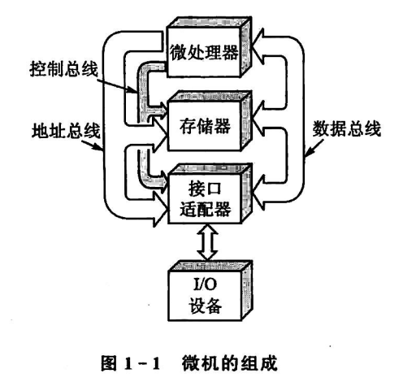

1. 地址总线
2. 数据总线
3. 控制总线

## 单片机(Singele Chip Microprocessor)

- 单片机
  - 微处理器
  - RAM
  - ROM
  - I/O 口
  - 定时器

**计算机模型**

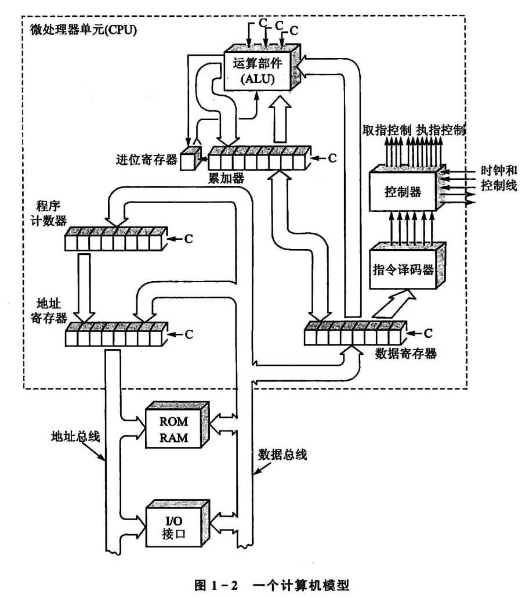

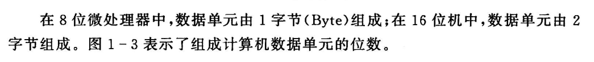

## 1 微机结构

### 1.1 运算器

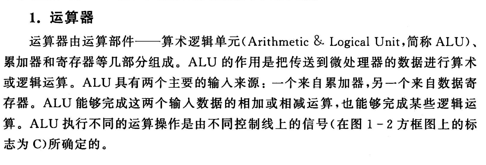

AUL 包含加减与或,比较等操作，**运算结果放在累加器**

ALU 收到控制线控制

- ALU 数据来源
  - 累加器
  - 数据寄存器

### 1.2 控制器

**控制器负责决策**

- 控制器
  - 程序计数器
  - 指令寄存器
  - 指令译码器
  - 时序产生器
  - 操作控制器

1. 从内存中取出一条指令，并指出吓一跳指令在内存中的位置
2. 对指令 i 女性译码或测试，并产生相应的操作控制信号，以便启动规定的动作
3. 指挥并控制 CPU

### 1.3 CPU 主要的寄存器

1. 累加寄存器(A)
2. 数据寄存器(DR)
3. 指令寄存器(IR)
4. 指令译码器(ID)
5. 程序计数器(PC)
6. 地址寄存器(AR)

#### 1.3.1 累加寄存器(A)

**累加器是处理器中最繁忙的寄存器**

- 累加计算器的作用
  - 运算前，保存一个操作数
  - 运算后，保存所得的和，差或逻辑运算的结果

#### 1.3.2 数据寄存器(DR)

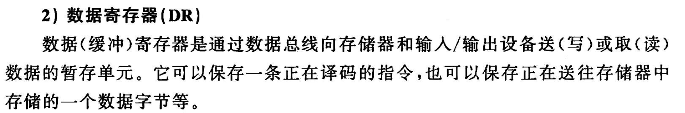

#### 1.3.3. 指令寄存器(IR)指令译码器(ID)

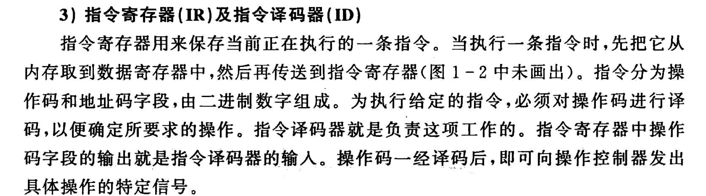

#### 1.3.4 程序计数器(PC)

指令地址计数器，初始值即起始地址。
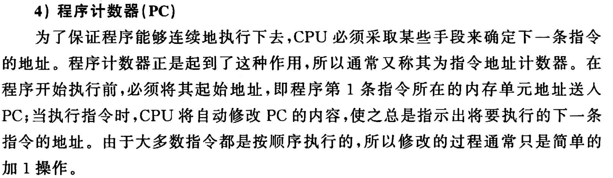

#### 1.3.5 地址寄存器(AR)

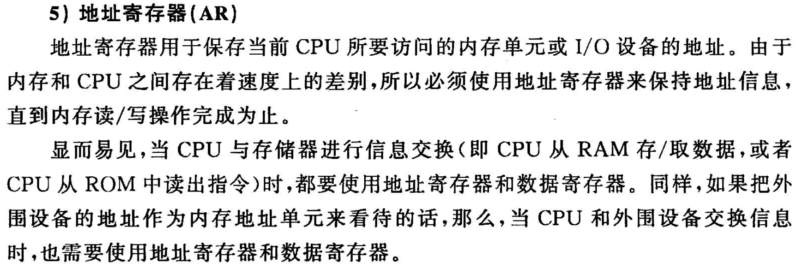

## 2 存储器的输入输出接口

### 2.1 存储器(RAM)

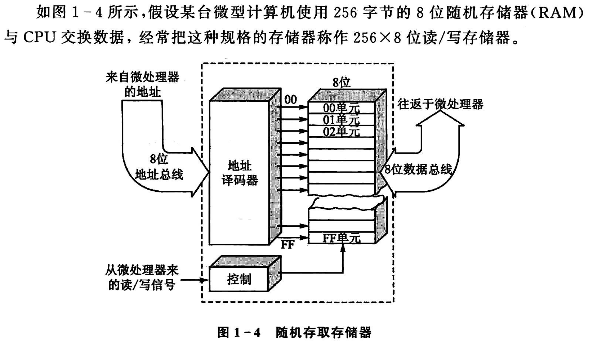

3-8译码器，2^3=8种地址
8位即可对应,2^8=256个地址
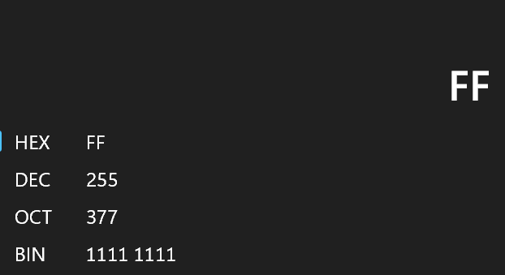

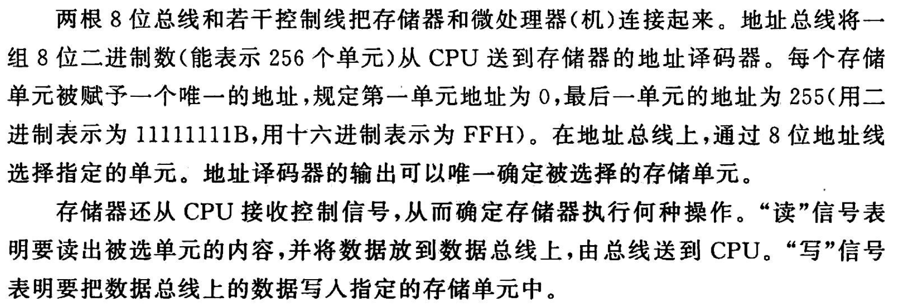

### 2.2 I/O接口及外设

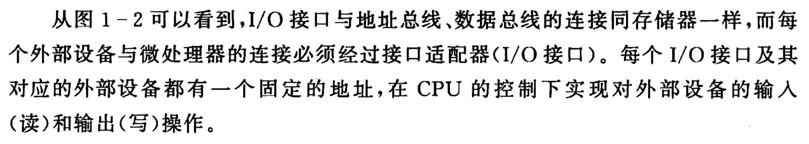

