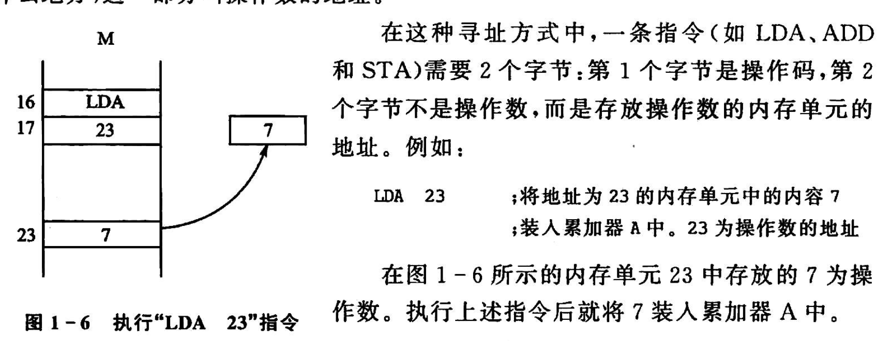
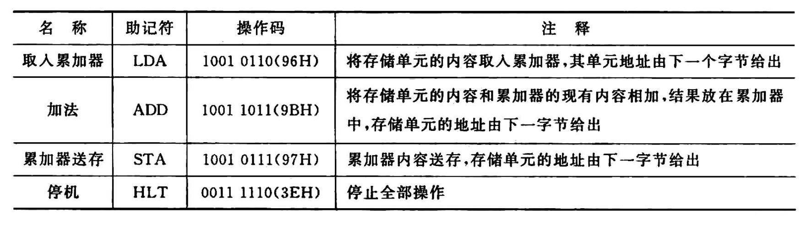
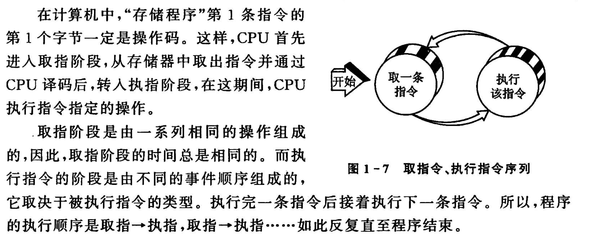
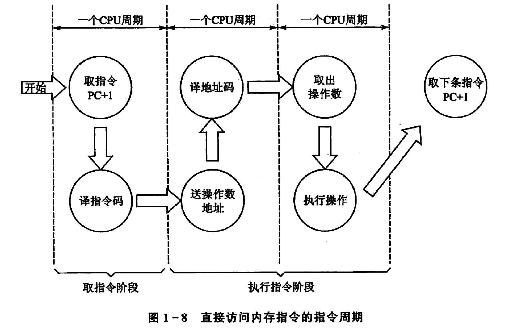
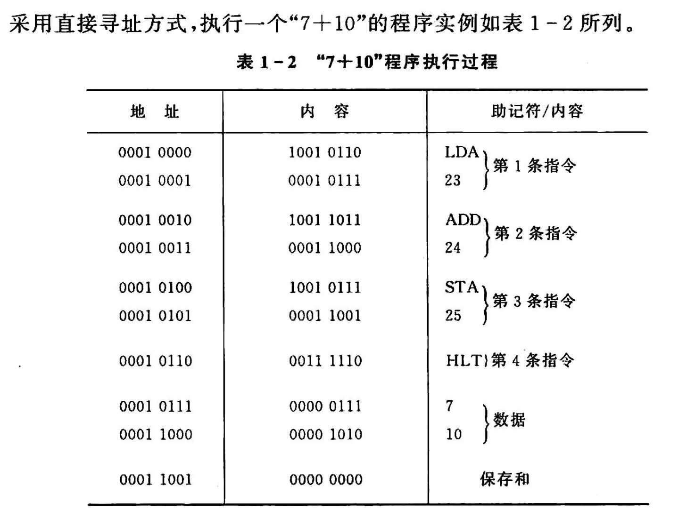
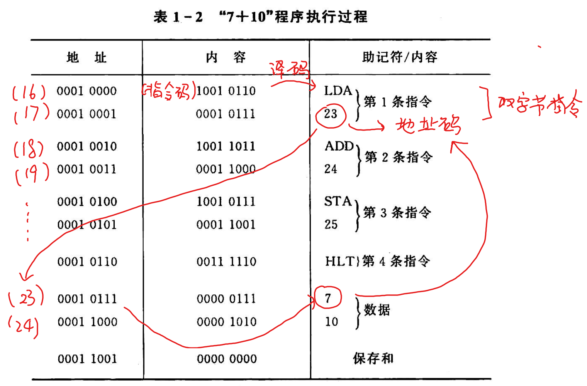
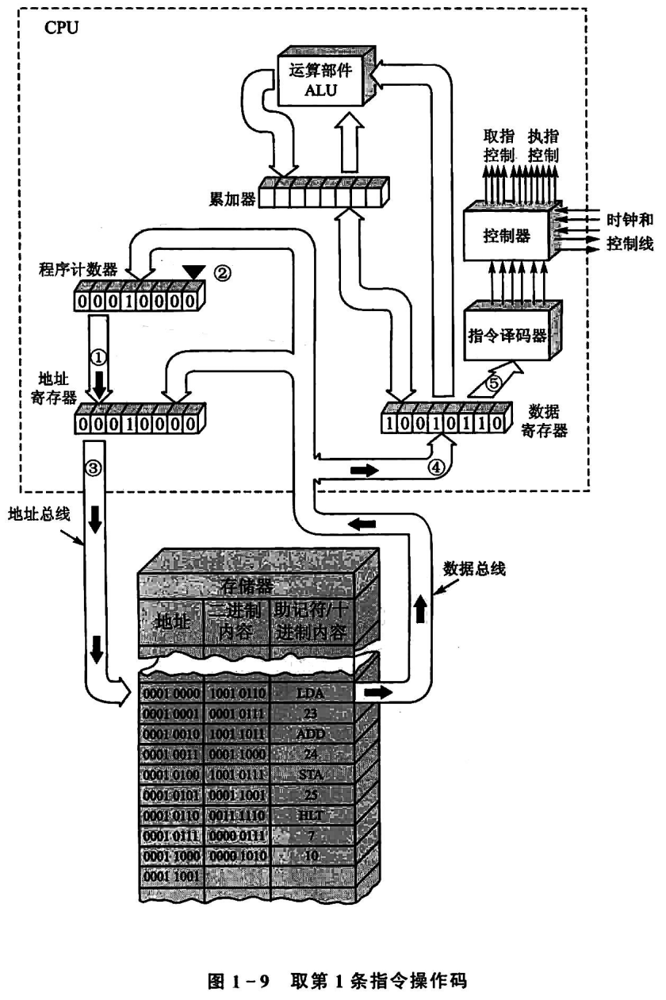
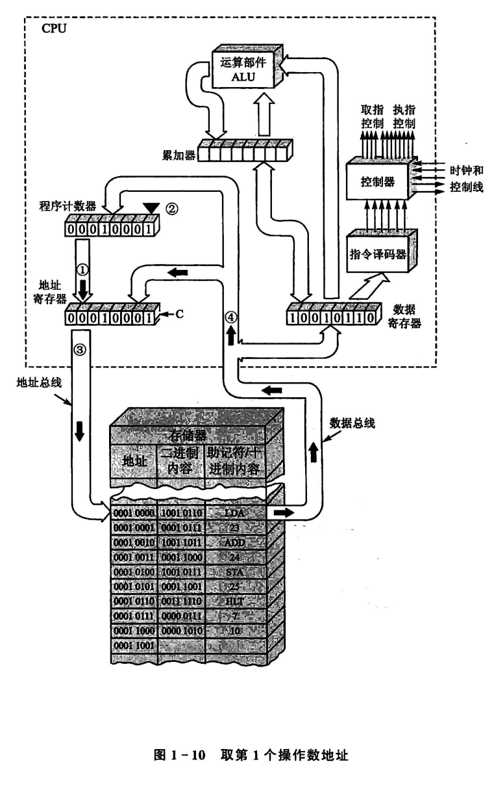
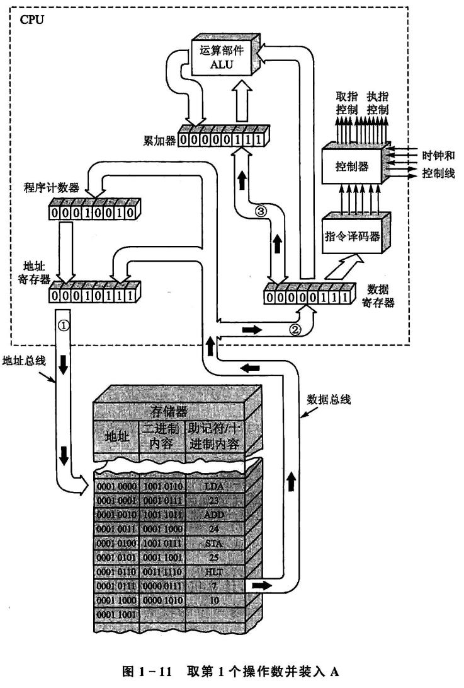

<!--
 * @Author: Ashington ashington258@proton.me
 * @Date: 2024-09-04 14:44:05
 * @LastEditors: Ashington ashington258@proton.me
 * @LastEditTime: 2024-09-04 15:08:42
 * @FilePath: \MCU_principle_and_interface_technology\2-微机工作原理.md
 * @Description: 请填写简介
 * 联系方式:921488837@qq.com
 * Copyright (c) 2024 by ${git_name_email}, All Rights Reserved. 
-->
# 微机工作原理

1. 寻址：寻找指令的操作数
2. 指令：操作码+操作数

LDA: Load Accumulator
ADD: Add
STA: Store Accumulator
HLT: Halt
## 1 执行指令的过程

## 2 执行一条指令的过程

## 3 执行一个程序的过程

