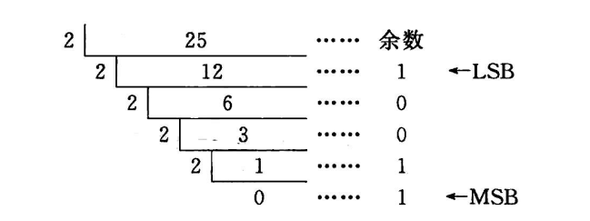
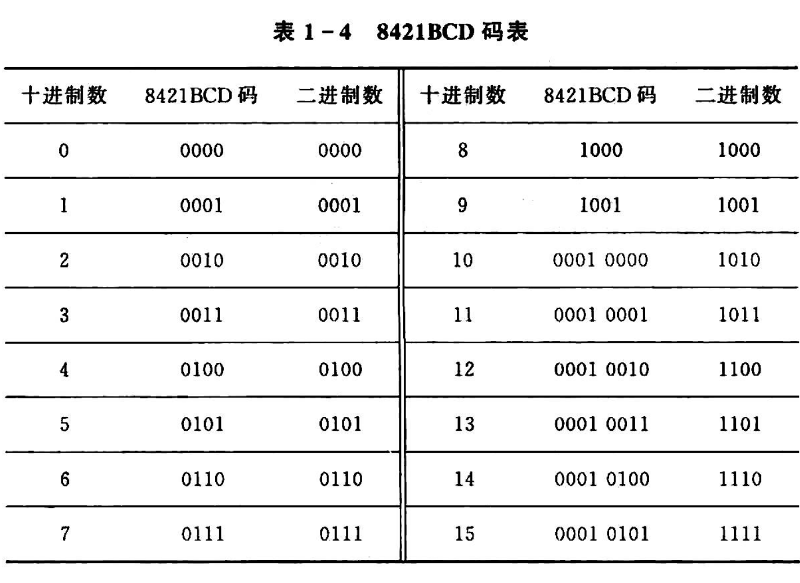
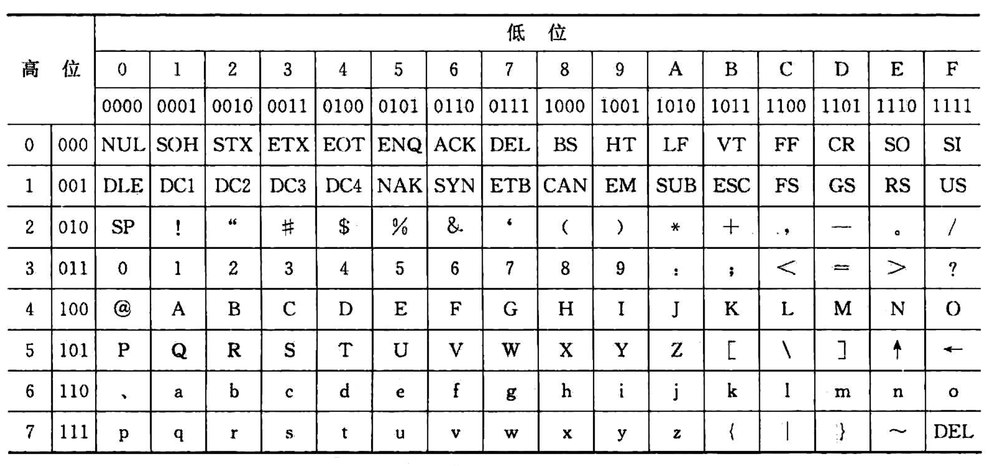

<!--
 * @Author: Ashington ashington258@proton.me
 * @Date: 2024-09-04 15:13:23
 * @LastEditors: Ashington ashington258@proton.me
 * @LastEditTime: 2024-09-09 10:33:45
 * @FilePath: \MCU_principle_and_interface_technology\1章节_微机基础知识\3-数制和编码.md
 * @Description: 请填写简介
 * 联系方式:921488837@qq.com
 * Copyright (c) 2024 by ${git_name_email}, All Rights Reserved. 
-->
# 数制和编码

## 1 数制

1. 二进制:$1001B = 1\times2^3 + 0\times2^2 + 0\times2^1 + 1\times2^0 = 9D$
2. 十进制:$1135D = 1\times10^3 + 1\times10^2 + 3\times10^1 + 5\times10^0$
3. 十六进制:$1C5H = 1\times16^2 + 14\times16^1 + 5\times16^0 = 453D$

## 2 进制转换

## 3 计算机常用编码

### 3.1 BCD码(Binary-Coded Decimal)

1. 4位BCD码表示一个十进制数，其中，每4

### 3.2 ASCII码(American Standard Code for Information Interchange)

ASCII码用于微机交互通讯

