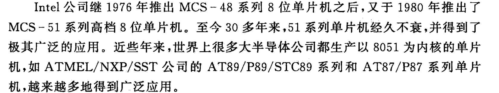

<!--
 * @Author: Ashington ashington258@proton.me
 * @Date: 2024-09-09 11:19:48
 * @LastEditors: Ashington ashington258@proton.me
 * @LastEditTime: 2024-09-09 15:08:41
 * @FilePath: \MCU_principle_and_interface_technology\1章节_微机基础知识\5-89C51_S51单片机.md
 * @Description: 请填写简介
 * 联系方式:921488837@qq.com
 * Copyright (c) 2024 by ${git_name_email}, All Rights Reserved. 
-->

# 89C51_S51单片机

1. 无程序储存器
2. 内部有ROM
3. ROM更换为EPROM
4. 更新为E2PROM

好的，感谢你的提醒！让我结合历史，补全程序储存器的发展历程。下面是更为完整和详细的程序储存器演进过程：

### 1. **无程序储存器**
在计算机发展的初期，尤其是早期的电子计算机（如ENIAC），程序并不是存储在任何内部存储器中，而是通过**外部设备**（例如穿孔卡片、穿孔纸带或手动连线板）进行输入和操作。这一时期的计算机没有存储器的概念，程序直接控制硬件操作，编程的过程十分复杂而低效。

### 2. **内部硬连线存储和微程序化控制**
随着计算机技术的发展，出现了基于**硬连线控制**的程序存储方式。计算机内部的控制逻辑通过物理电路实现，操作系统或程序的控制逻辑直接通过硬件配置来实现。这一阶段的代表是早期的数字计算机，依赖于硬连线的控制逻辑，并且无法通过软件灵活修改。

随后，计算机开始采用**微程序控制**（microprogramming），即使用一个较低层次的程序来控制计算机的指令集执行。微程序通常存储在ROM中，这是早期程序存储器发展的基础。

### 3. **ROM（只读存储器）的引入**
随着计算机设计的改进，**只读存储器（ROM）**成为存储计算机或微控制器固有程序的主要方式。ROM是一种不可更改的存储器，其内容在制造时被一次性写入，并且无法修改。ROM解决了硬连线控制电路的复杂性问题，并且使得程序可以以固态的方式存储在设备中。但由于内容不可更改，ROM的灵活性有限，只适用于不需要经常更新程序的应用场景。

- **时间背景**：在20世纪60年代至70年代，早期的嵌入式系统、游戏机以及家用计算机等常用ROM来存储固化的操作程序。

### 4. **PROM（可编程只读存储器）**
**PROM**（Programmable Read-Only Memory）是ROM的一种改进形式，允许用户在制造之后通过专用设备编程一次。虽然编程后仍然不能修改，但给了开发者一次自主编程的机会。这一技术提升了开发的灵活性，但无法擦除或重复使用。

- **时间背景**：20世纪70年代初，PROM开始用于小型嵌入式设备。

### 5. **EPROM（可擦除可编程只读存储器）**
为了克服PROM只能编程一次的限制，**可擦除可编程只读存储器（EPROM）**应运而生。EPROM允许用户通过紫外线照射来擦除存储内容，并重新编程。这样开发者能够在芯片制造后进行多次编程，增强了存储器的灵活性，但擦除和编程过程相对繁琐，且擦除速度较慢。

- **时间背景**：20世纪70年代末，EPROM成为嵌入式系统中广泛使用的存储器，尤其是在工业和消费电子领域，如早期的微控制器。

### 6. **EEPROM（电可擦除可编程只读存储器）**
**电可擦除可编程只读存储器（EEPROM）**是EPROM的进一步改进，允许通过电信号擦除和编程，不再需要紫外线照射。这一技术革新大大简化了编程过程，使得存储器可以被频繁擦写，同时可以部分擦除和更新，这使得EEPROM在灵活性和效率上有了质的飞跃。

- **时间背景**：20世纪80年代，EEPROM在嵌入式系统、个人电脑和消费电子设备中广泛应用。

### 7. **闪存（Flash Memory）**
闪存是EEPROM的改进，它允许在更大块区域中快速擦除和编程，并且具有更高的擦写次数和容量。**Flash存储器**分为NOR型和NAND型，广泛应用于现代的嵌入式系统、固态硬盘、U盘、手机等存储设备中。与EEPROM相比，闪存更具性价比且容量更大，适合大量数据存储。

- **时间背景**：闪存技术在20世纪90年代得到广泛应用，成为嵌入式系统和存储设备的主要技术之一。

### 8. **现代非易失性存储技术**
随着存储技术的进一步发展，**FRAM**（铁电随机存储器）、**MRAM**（磁阻随机存储器）等新型存储器被开发出来。这些存储器技术具有更快的读写速度、更高的擦写次数和更低的功耗，且有望替代部分EEPROM和闪存技术，成为未来非易失性存储器的主流。

- **时间背景**：21世纪以来，随着物联网、人工智能等技术的发展，这些新型存储器逐渐被引入高性能计算和嵌入式系统中。

### 发展总结
程序储存器的发展经历了从**无程序存储器**、**硬连线控制**到各种类型的**ROM**，再到可以擦写和多次编程的**EPROM**、**EEPROM**，直至今天广泛使用的**闪存技术**以及正在兴起的**新型存储器**。每一个阶段的进步都为计算设备的功能扩展和灵活性提升提供了支持，推动了从固定程序到可灵活更新程序的转变。这一发展过程不仅提高了设备的智能化，还促进了计算机和嵌入式系统在现代科技中的广泛应用。