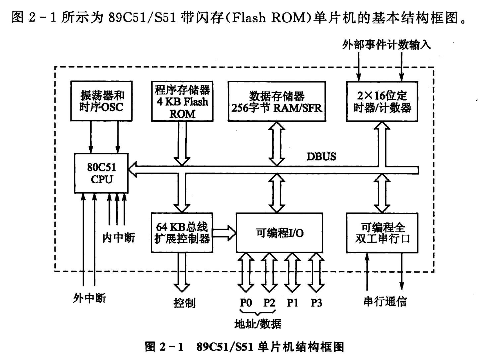

<!--
 * @Author: Ashington ashington258@proton.me
 * @Date: 2024-09-11 14:20:45
 * @LastEditors: Ashington ashington258@proton.me
 * @LastEditTime: 2024-09-14 10:02:18
 * @FilePath: \MCU_principle_and_interface_technology\2-89C51的硬件结构哟和原理\1-基本组成.md
 * @Description: 请填写简介
 * 联系方式:921488837@qq.com
 * Copyright (c) 2024 by ${git_name_email}, All Rights Reserved. 
-->
# 基本组成
- [基本组成](#基本组成)
  - [1 CPU(运算)](#1-cpu运算)
    - [1.1 运算器](#11-运算器)
    - [1.2 控制器](#12-控制器)
    - [1.3 I/O口](#13-io口)

## 1 CPU(运算)
**CPU**由运算器和控制器组成
### 1.1 运算器

1. **ALU**: Arithmetic Logic Unit（算术逻辑单元）
2. **ACC**: Accumulator（累加器）
3. **PSW**: Program Status Word（程序状态字）
4. **B**: Register B（寄存器B）
5. **布尔处理器**: Boolean Processor
6. 2个暂存器

###  1.2 控制器

以下是控制器相关部分的英文全称及说明：

1. **PC**: **Program Counter**（程序计数器）
   - 作用：用于存储即将执行的指令地址，通常在每执行一条指令后自动递增，以指向下一条指令。程序计数器（PC）有时会分为高字节（PCH）和低字节（PCL）
   - PCH
   - PCL

2. **IR/ID**: **Instruction Register** / **Instruction Decoder**（指令寄存器/指令解码器）
   - **IR**: 指令寄存器，存储当前正在执行的指令。
   - **ID**: 指令解码器，负责解码从指令寄存器中取出的指令，确定其操作类型和操作数。

3. **振荡器和定时电路**: **Oscillator and Timing Circuit**
   - 作用：提供时钟信号，确保系统按一定频率进行同步操作。振荡器负责生成时钟信号，而定时电路用来控制处理器执行每个操作的时序。

### 1.3 I/O口

