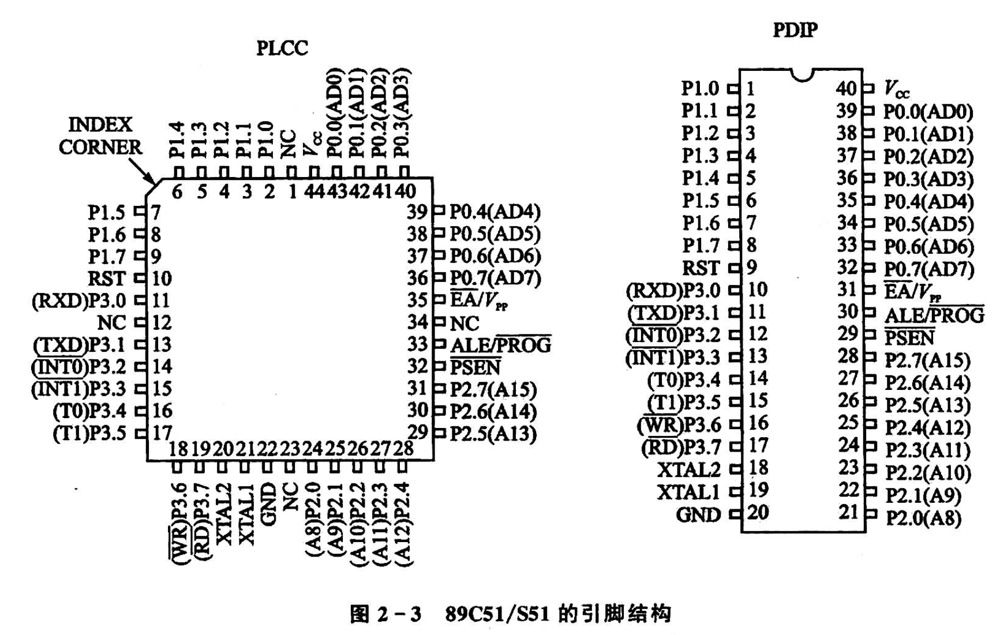
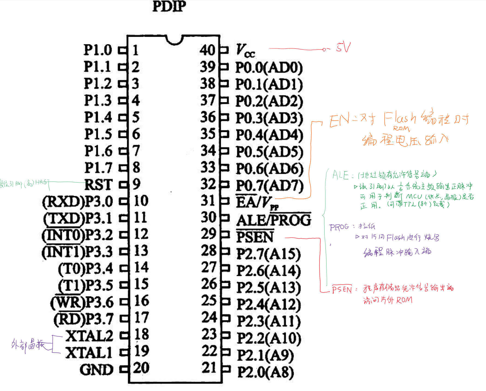
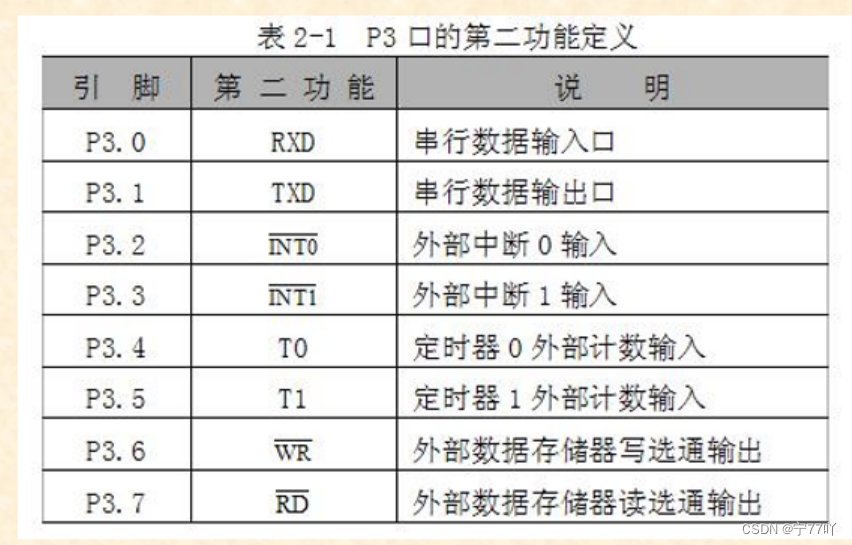
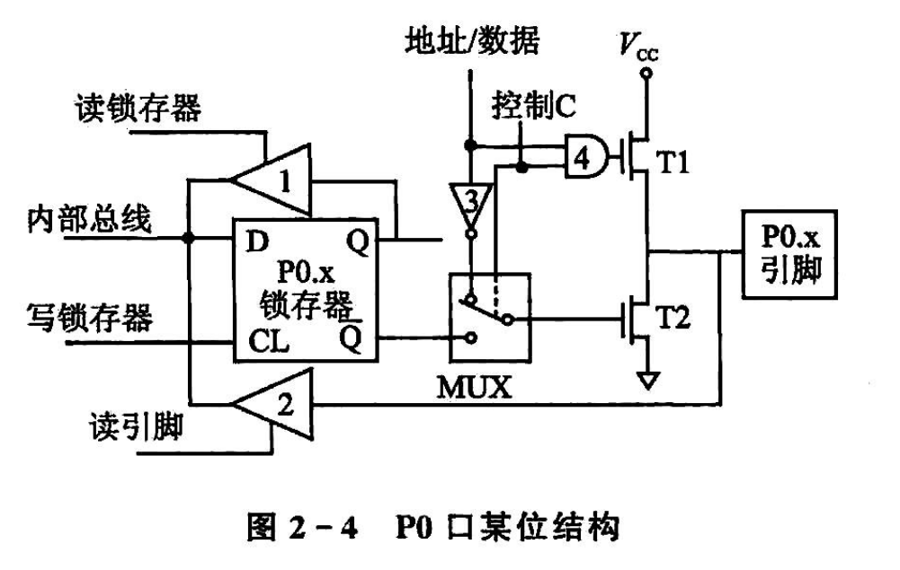

<!--
 * @Author: Ashington ashington258@proton.me
 * @Date: 2024-09-14 10:04:44
 * @LastEditors: Ashington ashington258@proton.me
 * @LastEditTime: 2024-09-14 11:17:30
 * @FilePath: \MCU_principle_and_interface_technology\2-89C51的硬件结构哟和原理\2-引脚及功能.md
 * @Description: 请填写简介
 * 联系方式:921488837@qq.com
 * Copyright (c) 2024 by ${git_name_email}, All Rights Reserved. 
-->
# 引脚功能

**高八位P2口，第八位P1口**