<!--
 * @Author: Ashington ashington258@proton.me
 * @Date: 2024-09-18 14:15:56
 * @LastEditors: Ashington ashington258@proton.me
 * @LastEditTime: 2024-09-18 15:30:56
 * @FilePath: \MCU_principle_and_interface_technology\2-89C51的硬件结构哟和原理\3-储存器配置.md
 * @Description: 请填写简介
 * 联系方式:921488837@qq.com
 * Copyright (c) 2024 by ${git_name_email}, All Rights Reserved. 
-->
# 储存器配置
- [储存器配置](#储存器配置)
  - [1 程序存储器地址空间](#1-程序存储器地址空间)
    - [1.1 程序存储器的分类](#11-程序存储器的分类)
    - [1.2 程序存储器（ROM）的使用(编址)](#12-程序存储器rom的使用编址)
    - [1.3 数据储存器（RAM）的使用](#13-数据储存器ram的使用)
      - [1.3.1 片外RAM](#131-片外ram)
      - [1.3.2 片内RAM](#132-片内ram)
        - [1.3.2.1 低128位RAM](#1321-低128位ram)
        - [1.3.2.2 高128位RAM（SFR）特殊功能寄存器](#1322-高128位ramsfr特殊功能寄存器)

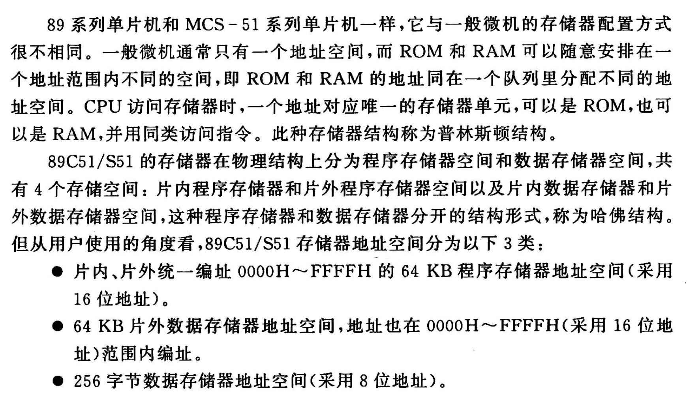

## 1 程序存储器地址空间

### 1.1 程序存储器的分类

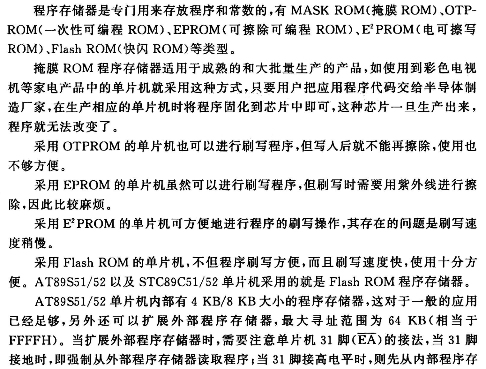

### 1.2 程序存储器（ROM）的使用(编址)

0000H~0FFFH -4kB(2^12)
0000H~FFFFH -64kB

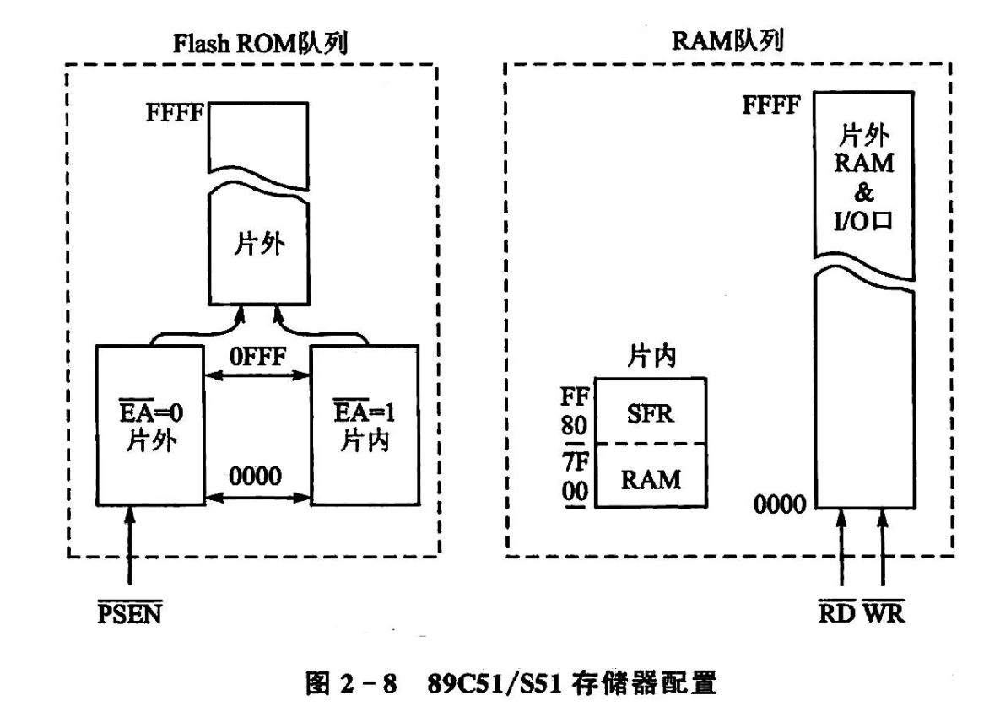
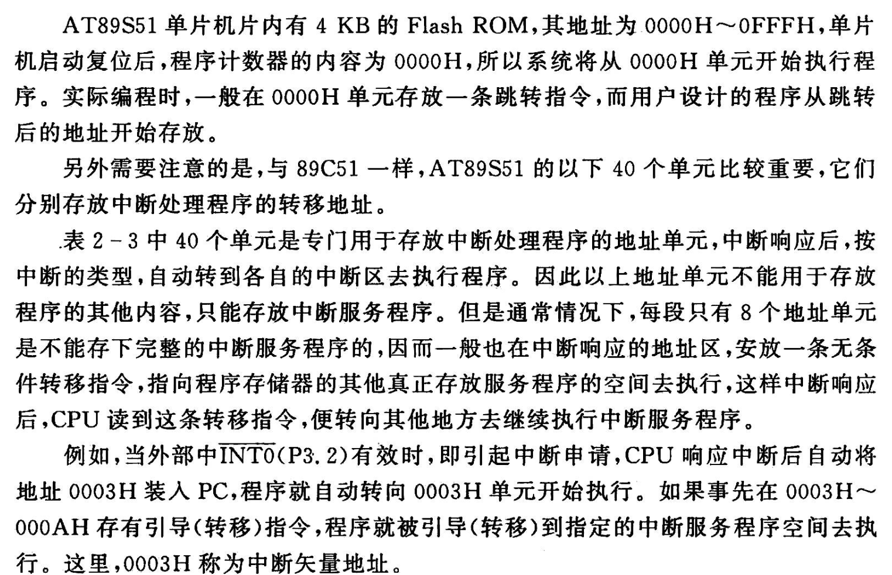

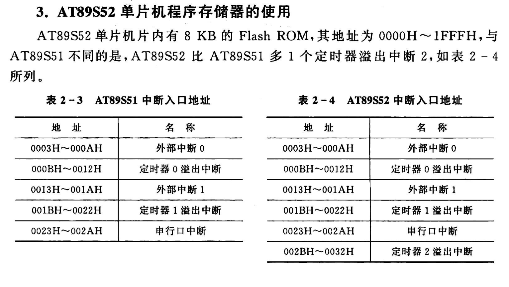

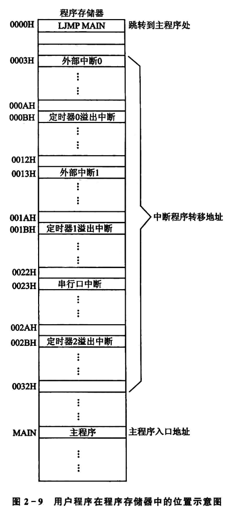

### 1.3 数据储存器（RAM）的使用

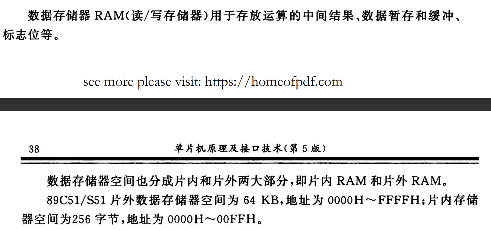

#### 1.3.1 片外RAM

#### 1.3.2 片内RAM

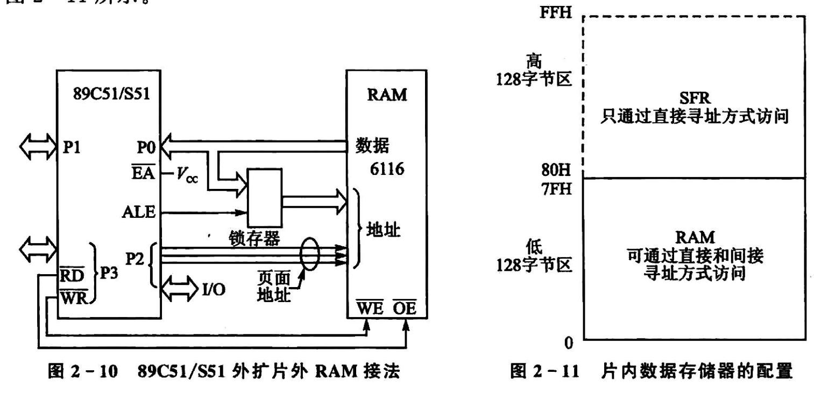

- 低129B字节RAM
  - 工作寄存器(00H~1FH)
  - 位寻址区(20H~2FH)
  - 用户RAM()

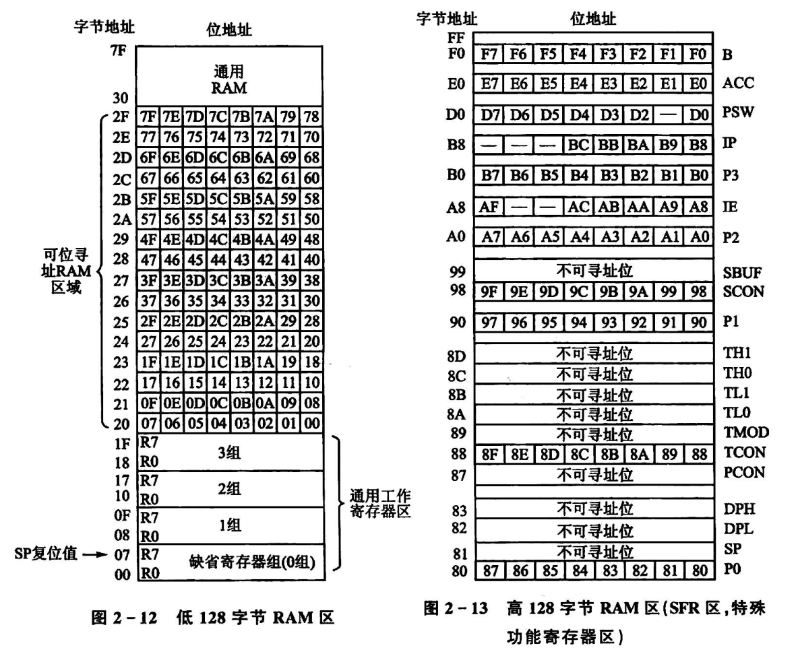

##### 1.3.2.1 低128位RAM
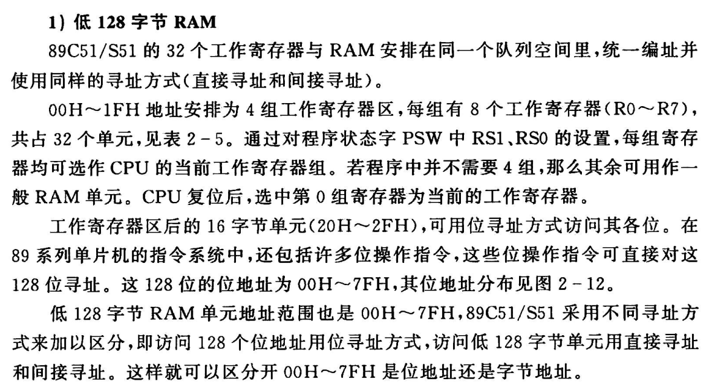
##### 1.3.2.2 高128位RAM（SFR）特殊功能寄存器

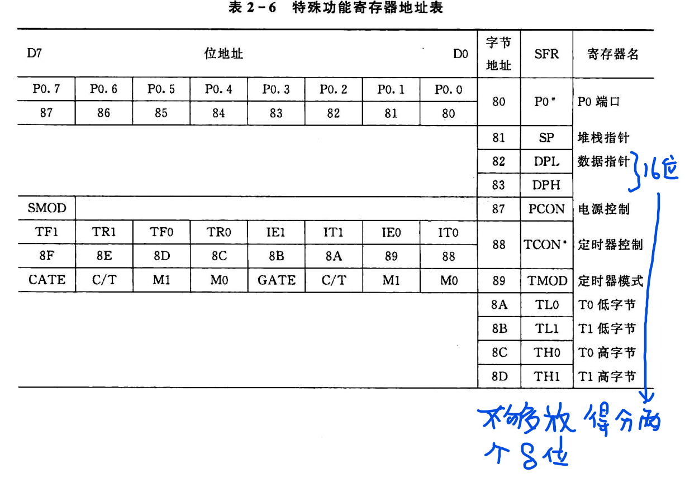
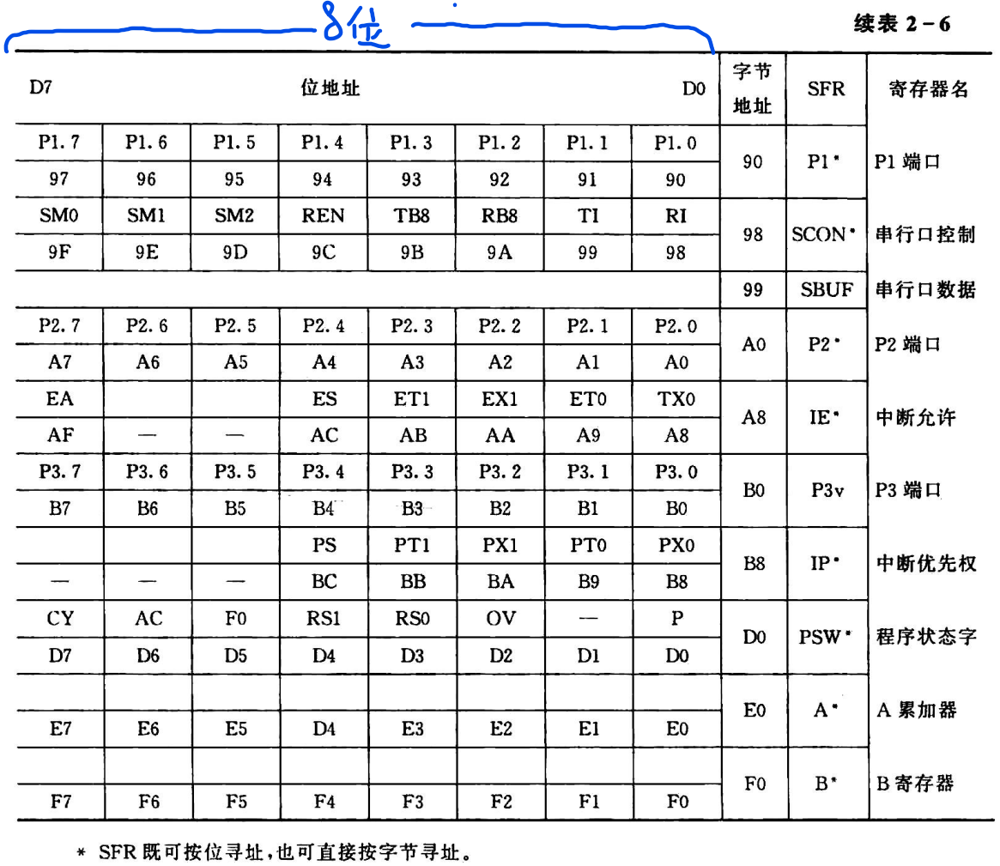

- **位具体介绍**
  1. `累加器ACC`(E0H)：用于存放第一个操作数的结果
  2. 寄存器B(F0H)：
     1. 乘法中表示成功书和乘积的高8位
     2. 除法中存放除数和余数
     3. 其他指令中用作一般寄存器或RAM单元
  3. `程序状态寄存器PSW`(D0H)：
     1. 程序执行的状态，可以用于查询或判断。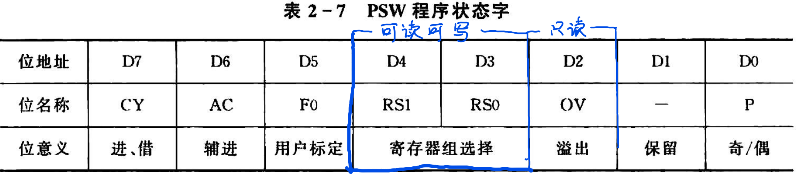[读取方式]1. PSW.7 2. D0.7 3. D7H
     2. 各位的含意
        1. CY位；仅为，借位发生时CY=1。{判断两个数的大小}
        2. AC：半进位，半字节进位。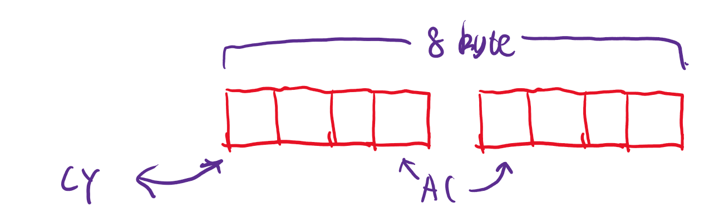
        3. FO位：用户标志。用户自定义
        4. RS0/RS1:工作寄存器组选择控制位，该位可读可写。上电默认0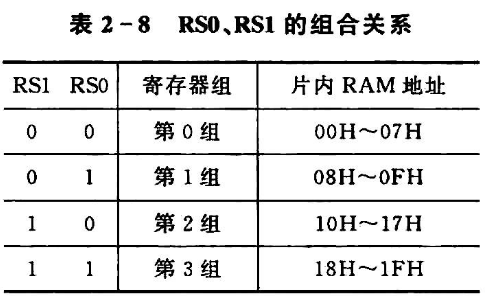
        5. `OV位`一处标志位：运算结果超过-128~127范围，OV=1，则当前计算不可靠。
        6. P位；奇偶校验位{最常见的校验方式}每条指令执行后，A中的"1"的个数为奇数，则P=1;否则，P=0。
  4. `堆栈指针SP`：堆栈`先进后出`主要用于保护断点。空间位于`RAM 00H~7FH`的单元SP初始化为07H。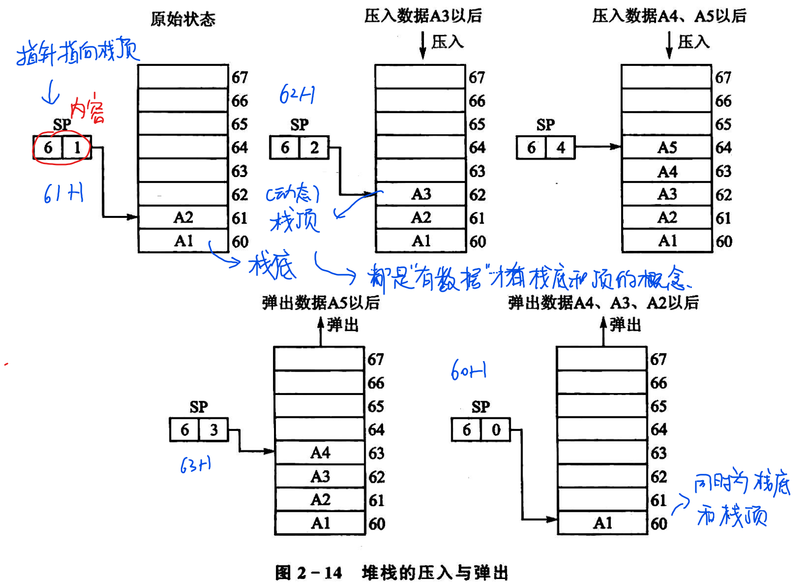
  5. 数据指针DPTR{地址指针}：
     1. DPTR是16位,DPH,DPL可以单独使用，最好一起写
  6. I/O口P0,P1,P2,P3(80H,90H,10H,B0H)：分别是四个并行端口的锁存器。

