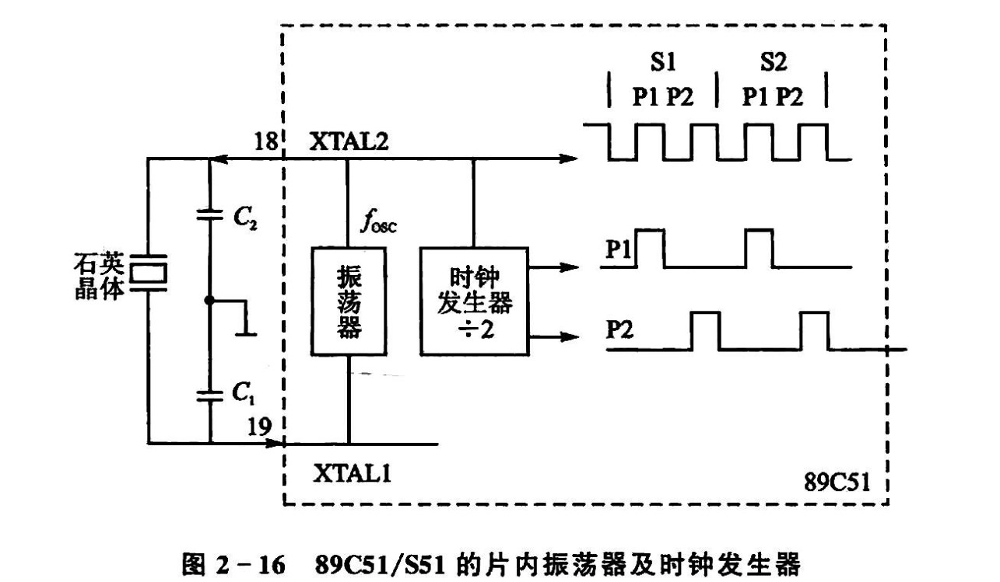
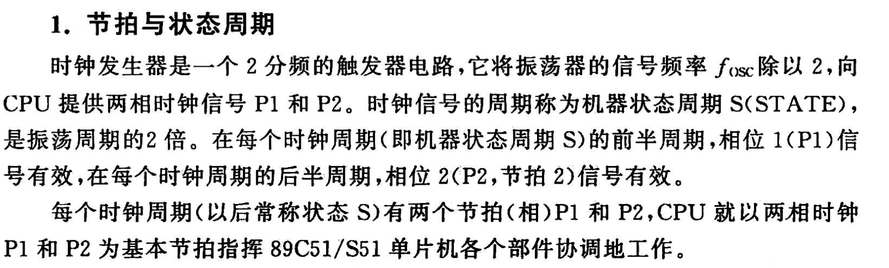
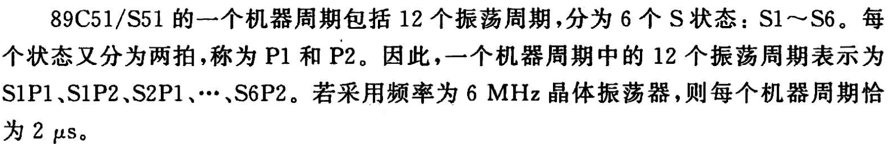
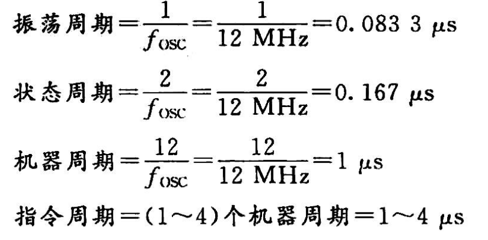
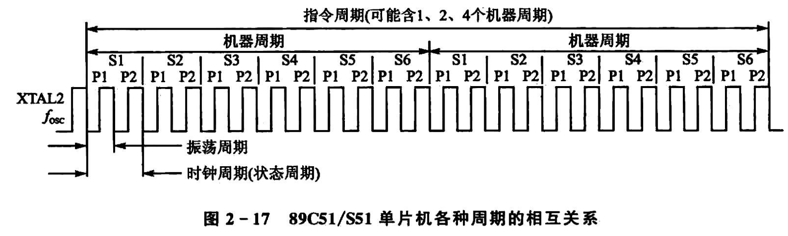

# CPU时序

## 1 节拍和状态周期

1. 振荡周期-$f_{osc}$-12Mhz
2. 状态周期{时钟周期}：6Mhz
3. 时钟周期：6Mhz

利用P1,P2上升沿和下降沿进行工作。

## 2 机器周期和指令周期

1. `机器周期`：**机器周期 = 12×振荡周期=1Mhz**

1. 振荡周期(晶振)是最小周期
2. 状态周期是二分频后提供给CPU
3. 机器周期(MC)：6个状态周期，即12个振荡周期，12分频率
4. 指令周期1~4个机器周期