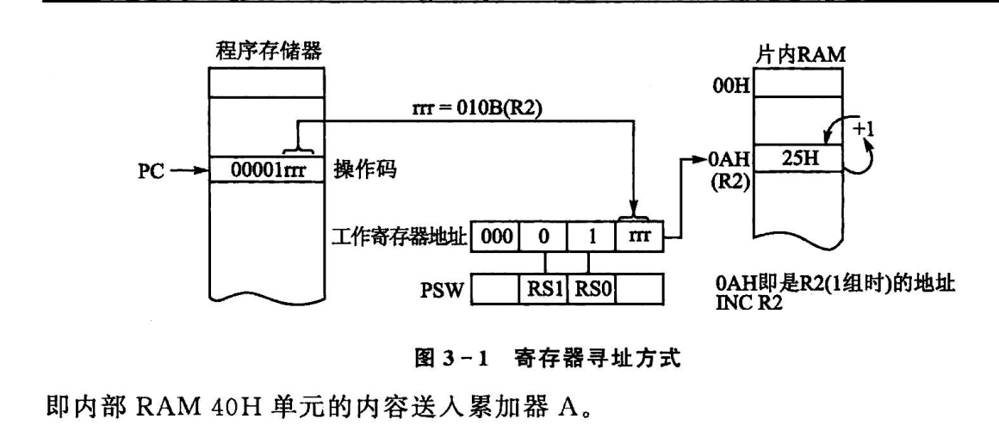

# 汇编语言

- [汇编语言](#汇编语言)
  - [1 指令格式](#1-指令格式)
    - [1.1 单字节指令](#11-单字节指令)
    - [1.2 双字节指令](#12-双字节指令)
    - [1.3 三字节指令](#13-三字节指令)
  - [2 寻址方式](#2-寻址方式)
    - [2.1 寄存器寻址（工作寄存器R0~R7）](#21-寄存器寻址工作寄存器r0r7)
    - [2.2 直接寻址](#22-直接寻址)
    - [2.3 立即数寻址](#23-立即数寻址)
    - [2.4 寄存器间接寻址](#24-寄存器间接寻址)

## 1 指令格式


**操作码是必要的**

### 1.1 单字节指令


### 1.2 双字节指令


### 1.3 三字节指令


## 2 寻址方式

**寻址方式**：如何找到存放操作数的地址，吧操作数提取出来。

<例如温度变量不是常量，找变量是多少>

### 2.1 寄存器寻址（工作寄存器R0~R7）

- **寄存器寻址**：由指令指出寄存器R0~R7中的某一个或者其他寄存器的内容作为操作数

- MOV A, R0;`R0是一个地址，吧R0地址的值读取出来，即是一个常数，放到地址A当中。` $(R_0)\rightarrow A$`括号代表取地址值`

- MOV P1, A;
- ADD A, R0;$(A)+(R0)\rightarrow A$`把A的数值取出来，和R0的值相加，再放回A中`


### 2.2 直接寻址

直接给出操作数所在的存储单元的地址，指令中操作数部分是操作数所在的地址。

对于SFR既可以使用他们的地址，也可以使用他们的名字。

- MOV A, 3AH; $(3AH)\rightarrow A$
- MOV A, P1;`P1是名字`
- MOV A, 90H;`90H是地址，两者都是等效的`




### 2.3 立即数寻址

**立即数就是常数，用#号表示**


**注意和寻址方式的区别，他没有取出地址的值**

```asm

MOV DPTR, #2000H ; $2000H\rightarrow DPTR$
                    ; $(DPH) = 20H$
                    ; $(DPL) = 00H$$

```

### 2.4 寄存器间接寻址

操作数的地址放在某个寄存器当中(寄存器本身就是地址，因此本质就是`地址的地址`)

```asm
MOV A, @R0 ;`R0的`

```


