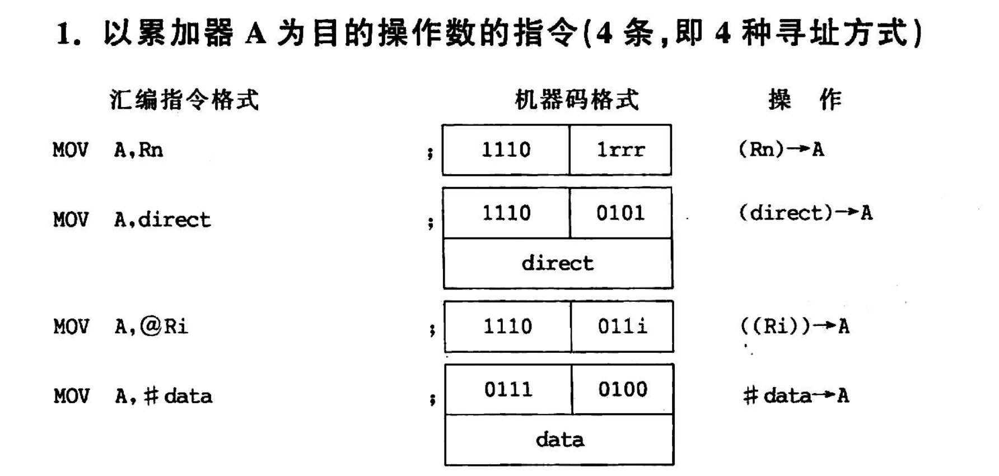
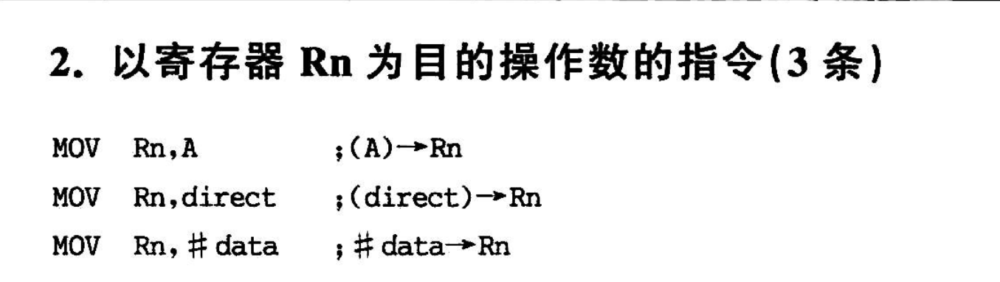
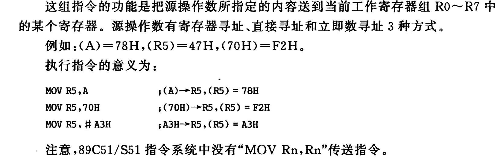

# 89C51指令系统
- **指令系统的五大类**
  1. 数据传输指令
  2. 算法运算指令
  3. 逻辑运算及位移指令
  4. 控制转移指令
  5. 位操作指令

## 1 以累加器A为目的的操作数的指令(4条，即4种寻址方式)



## 2 以寄存器Rn为目的的操作数的指令(3条)




==两个寄存器之间不能对拷==

例如不可以

```asm

MOV Rn , Rn

```

## 3 以直接地址为目的的操作数的指令(5条)

至少两字节


