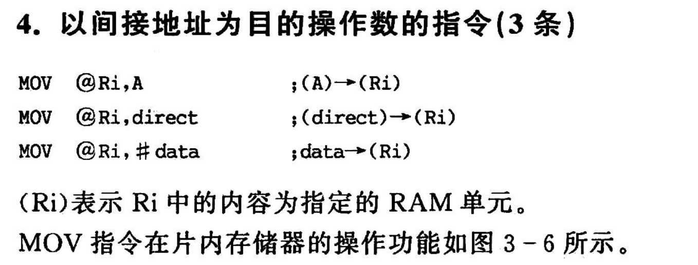
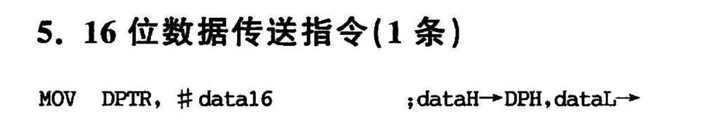
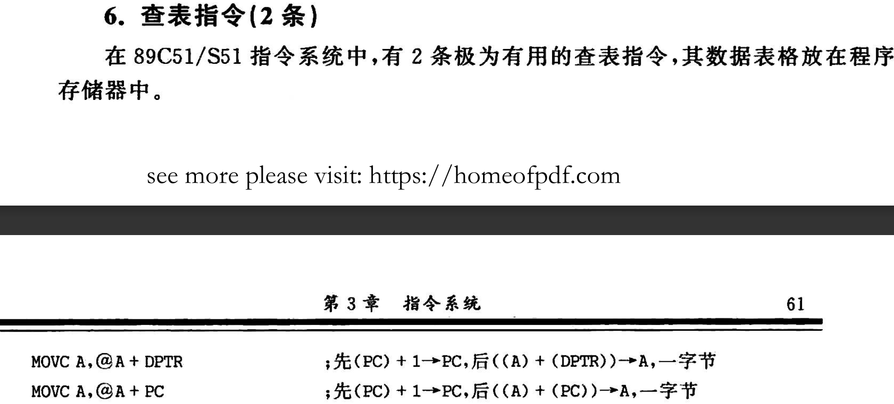

# 89C51 指令系统
- [89C51 指令系统](#89c51-指令系统)
  - [1 以累加器 A 为目的的操作数的指令(4 条，即 4 种寻址方式)](#1-以累加器-a-为目的的操作数的指令4-条即-4-种寻址方式)
  - [2 以寄存器 Rn 为目的的操作数的指令(3 条)](#2-以寄存器-rn-为目的的操作数的指令3-条)
  - [3 以直接地址为目的的操作数的指令(5 条)](#3-以直接地址为目的的操作数的指令5-条)
  - [4 以间接地址为目的的操作数的指令(3 条)](#4-以间接地址为目的的操作数的指令3-条)
  - [5 MOV 指令的图解](#5-mov-指令的图解)
  - [6 16 位数据传送指令(1 条)](#6-16-位数据传送指令1-条)
  - [7 查表指令(2 条)-变址寻址](#7-查表指令2-条-变址寻址)

## 1 以累加器 A 为目的的操作数的指令(4 条，即 4 种寻址方式)


## 2 以寄存器 Rn 为目的的操作数的指令(3 条)


==两个寄存器之间不能对拷==

例如不可以

```asm

MOV Rn , Rn

```

## 3 以直接地址为目的的操作数的指令(5 条)

至少两字节


## 4 以间接地址为目的的操作数的指令(3 条)



## 5 MOV 指令的图解


## 6 16 位数据传送指令(1 条)



## 7 查表指令(2 条)-变址寻址


