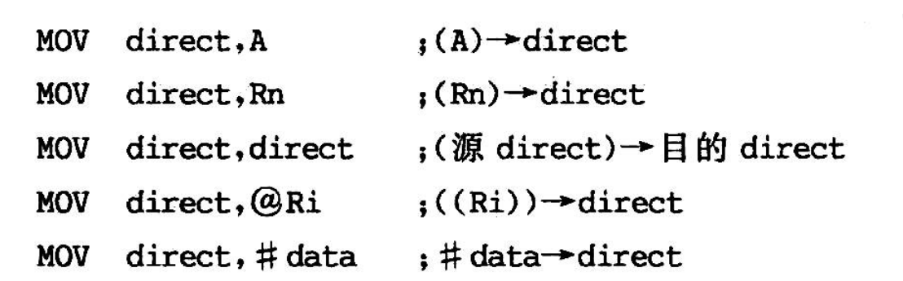
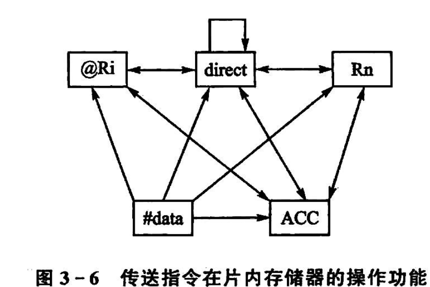
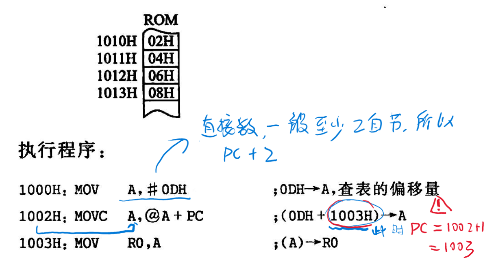
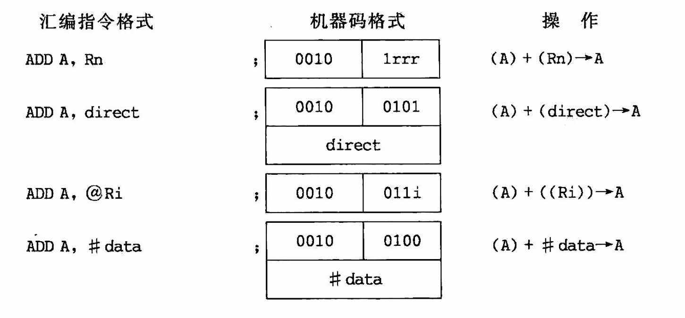
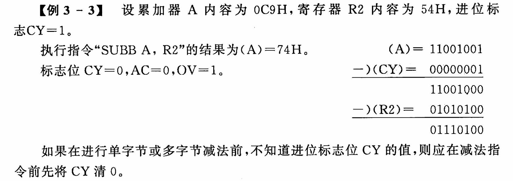
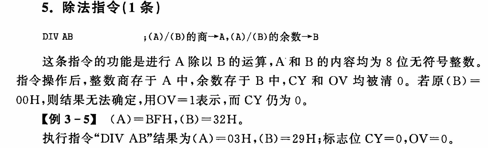
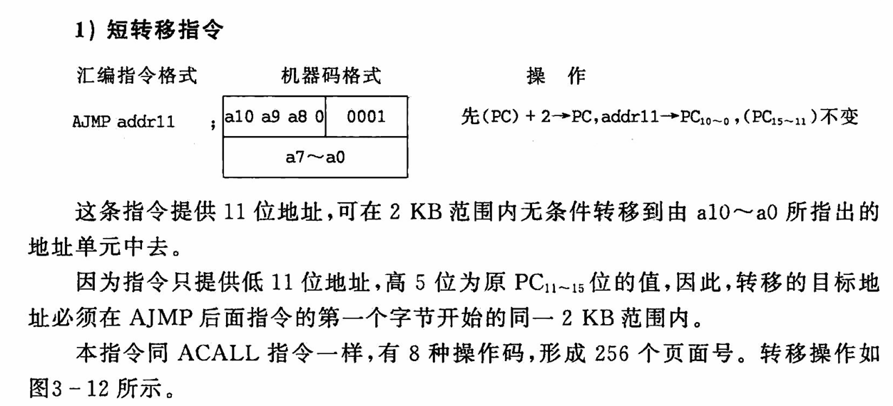

# 89C51 指令系统

- [89C51 指令系统](#89c51-指令系统)
  - [1 数据传送指令](#1-数据传送指令)
    - [1.1 以累加器 A 为目的的操作数的指令(4 条，即 4 种寻址方式)](#11-以累加器-a-为目的的操作数的指令4-条即-4-种寻址方式)
    - [1.2 以寄存器 Rn 为目的的操作数的指令(3 条)](#12-以寄存器-rn-为目的的操作数的指令3-条)
    - [1.3 以直接地址为目的的操作数的指令(5 条)](#13-以直接地址为目的的操作数的指令5-条)
    - [1.4 以间接地址为目的的操作数的指令(3 条)](#14-以间接地址为目的的操作数的指令3-条)
      - [1.4.1 MOV 指令的图解](#141-mov-指令的图解)
    - [1.5 16 位数据传送指令(1 条)](#15-16-位数据传送指令1-条)
    - [1.6 查表指令(2 条)-变址寻址](#16-查表指令2-条-变址寻址)
      - [1.6.1 寻址范围对比](#161-寻址范围对比)
      - [1.6.2 查表法](#162-查表法)
    - [1.7 累加器 A 与片外 RAM 的传送指令(4 条)](#17-累加器-a-与片外-ram-的传送指令4-条)
    - [1.8 栈操作指令(两条)](#18-栈操作指令两条)
      - [1.8.1 PUSH（入栈）](#181-push入栈)
      - [1.8.2 POP（出栈）](#182-pop出栈)
    - [1.9 交换指令(4 条)](#19-交换指令4-条)
      - [1.9.1 字节交换指令](#191-字节交换指令)
      - [1.9.2 半字节交换](#192-半字节交换)
  - [2 算数运算指令](#2-算数运算指令)
    - [2.1 加法指令(4 条)](#21-加法指令4-条)
    - [2.2 带进位的加法指令（4 条）](#22-带进位的加法指令4-条)
    - [2.3 带错位的减法](#23-带错位的减法)
    - [2.4 乘法指令(1条)](#24-乘法指令1条)
    - [2.5 除法指令(1条)](#25-除法指令1条)
    - [2.6 加1指令(5条)](#26-加1指令5条)
    - [2.7 减1指令(4条)](#27-减1指令4条)
    - [2.7 十进制调整指令(1条)](#27-十进制调整指令1条)
  - [3 逻辑操作指令](#3-逻辑操作指令)
    - [3.1 简单操作指令(2条)](#31-简单操作指令2条)
    - [3.2 移位指令(4条)](#32-移位指令4条)
    - [3.3 累加器半字节交换指令\*()](#33-累加器半字节交换指令)
    - [3.4 逻辑`与`指令(6条)](#34-逻辑与指令6条)
    - [3.5 逻辑`或`指令(6条)](#35-逻辑或指令6条)
    - [3.6 逻辑`异或`指令(6条)](#36-逻辑异或指令6条)
  - [4 控制程序转移类指令](#4-控制程序转移类指令)
    - [4.1 无条件转移指令(4条)](#41-无条件转移指令4条)
      - [4.1.1 短转移指令](#411-短转移指令)
      - [4.1.2 长转移指令](#412-长转移指令)
      - [4.1.3 相对转移(短转移)指令](#413-相对转移短转移指令)
      - [4.1.4 间接转移指令](#414-间接转移指令)
    - [4.2 空操作指令](#42-空操作指令)
    - [4.3 条件转移类指令(8条)](#43-条件转移类指令8条)
      - [4.3.1 判零转移指令](#431-判零转移指令)
      - [4.3.2 比较转移指令](#432-比较转移指令)

## 1 数据传送指令

### 1.1 以累加器 A 为目的的操作数的指令(4 条，即 4 种寻址方式)


### 1.2 以寄存器 Rn 为目的的操作数的指令(3 条)


==两个寄存器之间不能对拷==

例如不可以

```asm

MOV Rn , Rn

```

### 1.3 以直接地址为目的的操作数的指令(5 条)

至少两字节



### 1.4 以间接地址为目的的操作数的指令(3 条)


#### 1.4.1 MOV 指令的图解



### 1.5 16 位数据传送指令(1 条)


### 1.6 查表指令(2 条)-变址寻址


#### 1.6.1 寻址范围对比


PC 无法赋初始值，DPTR 可以赋初始值，寻址范围达到 64K

#### 1.6.2 查表法




### 1.7 累加器 A 与片外 RAM 的传送指令(4 条)


`MOVX`片外寻址

### 1.8 栈操作指令(两条)


#### 1.8.1 PUSH（入栈）


```asm

PUSH

```

#### 1.8.2 POP（出栈）


### 1.9 交换指令(4 条)

#### 1.9.1 字节交换指令


#### 1.9.2 半字节交换


## 2 算数运算指令

### 2.1 加法指令(4 条)



### 2.2 带进位的加法指令（4 条）


### 2.3 带错位的减法




### 2.4 乘法指令(1条)


**若指令乘积大于0FFH，侧OV置1，否则清0，Cy位总被清0**

### 2.5 除法指令(1条)



### 2.6 加1指令(5条)


### 2.7 减1指令(4条)


### 2.7 十进制调整指令(1条)


## 3 逻辑操作指令

### 3.1 简单操作指令(2条)

CLR 将A中的数取反再赋给A


### 3.2 移位指令(4条)


```ASM
RL A ;左循环，相当于乘2
```

### 3.3 累加器半字节交换指令*()


### 3.4 逻辑`与`指令(6条)


### 3.5 逻辑`或`指令(6条)


### 3.6 逻辑`异或`指令(6条)


## 4 控制程序转移类指令

### 4.1 无条件转移指令(4条)

#### 4.1.1 短转移指令



#### 4.1.2 长转移指令

ORG 1000H，不占字节


#### 4.1.3 相对转移(短转移)指令


#### 4.1.4 间接转移指令


### 4.2 空操作指令


### 4.3 条件转移类指令(8条)


#### 4.3.1 判零转移指令


#### 4.3.2 比较转移指令

