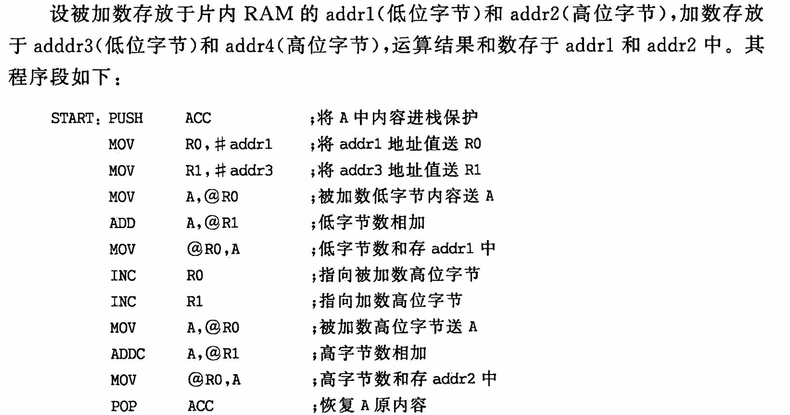
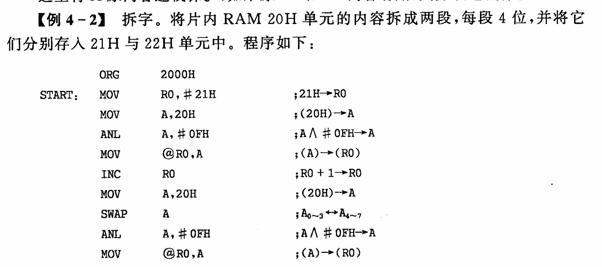
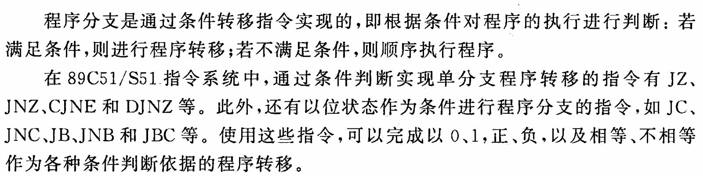
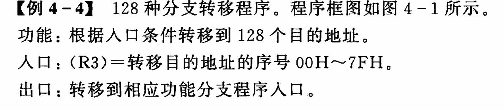
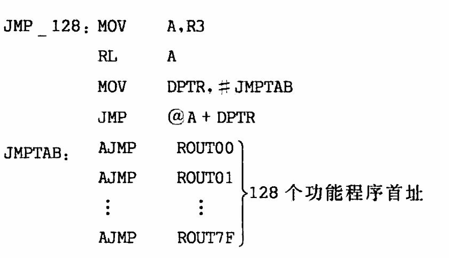
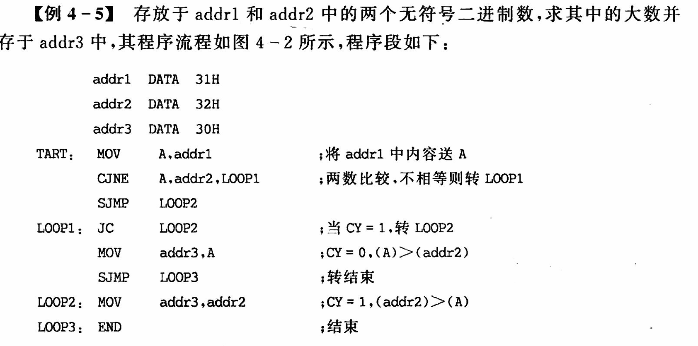

# 编程方法

## 1 语法结构

### 1.1 标号

**标号是地址**

### 1.2 操作码

**操作码是必须的**

### 1.3 操作数

单操作数，双操作数，个别三字节操作数

- **操作数的内容**
  - 工作寄存器 PSW.3 PSW.4
  - `特殊功能寄存器`：21 个 SFR 的名字
  - 标号名：EQU 等赋值的标号
  - 常数：数字末尾需要加 B,H 等指明进制格式
  - $：用来表示程序计数器 d
  - 表达式：汇编时，计算出表达式的值填入目标码

## 2 编程的方法和技巧

1. 循环结构
2. 减少无条件转移
3. 通用子程序，考虑通用性，除了用于存放程序入口的寄存器外，其他子程序用到的其他寄存器的内容应压入堆栈
4. 在中断处理程序中，除了需要保护处理程序中用到的寄存器外，还需要保护标志寄存器
5. 用累加器传递入口参数或返回参数比较方便,在子程序中，一般不必要把累加器压入堆栈

### 2.1 顺序

### 2.2 分支

JZ JNZ CJNE DJNZ  
JC JNC JB JNB

