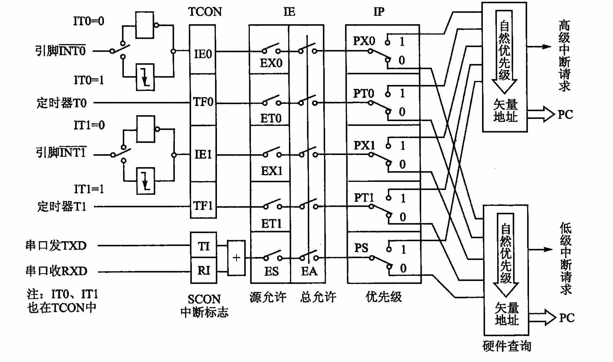
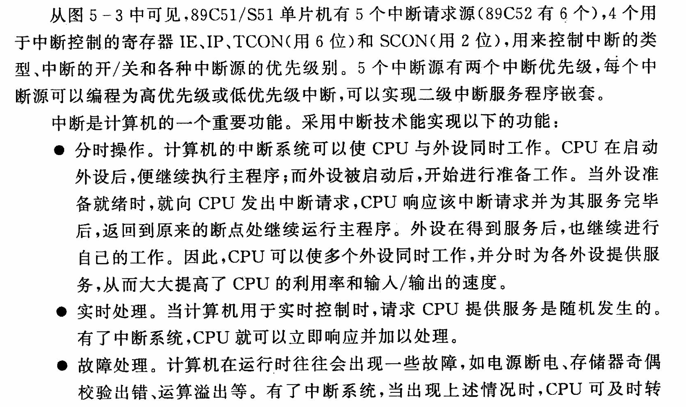
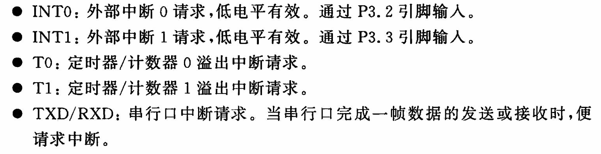
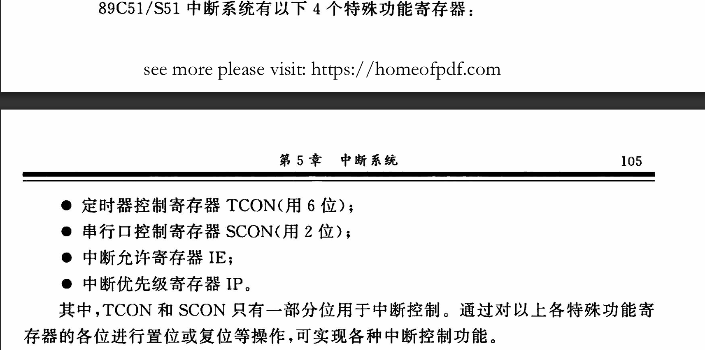
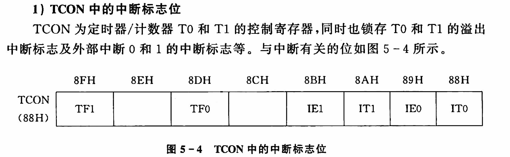
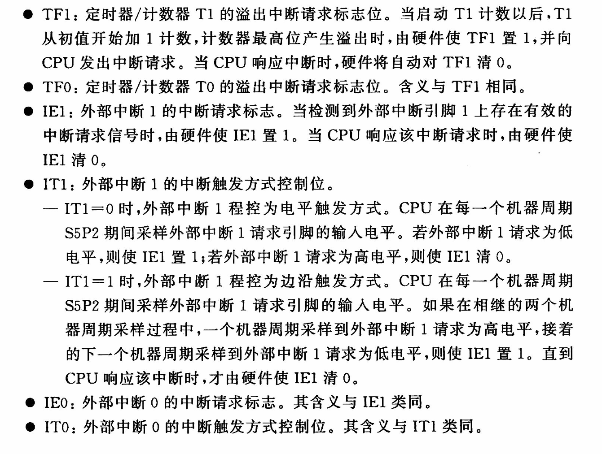

# 3-89C51 的中断结构和控制

# 51 单片机中的寄存器

在 51 单片机中，`TCON` 和 `SCON` 是两个重要的特殊功能寄存器（SFR），分别用于控制定时器/计数器和串行通信。

### SCON (Serial Control Register)

- **SCON** 是串行控制寄存器，用于控制串行通信的工作模式和状态。
- **位定义**:
  - **SM0, SM1 (Serial Mode Select Bits)**: 串行通信模式选择位，组合决定串行通信的工作模式。
    - 00: 模式 0，移位寄存器模式。
    - 01: 模式 1，8 位 UART 模式。
    - 10: 模式 2，9 位 UART 模式，固定波特率。
    - 11: 模式 3，9 位 UART 模式，可变波特率。
  - **SM2 (Multiprocessor Communication Enable Bit)**: 多处理器通信使能位，仅在模式 2 和 3 中有效。
  - **REN (Receiver Enable Bit)**: 接收使能位，1 表示允许接收数据。
  - **TB8 (Transmit Bit 8)**: 发送第 9 位数据，仅在模式 2 和 3 中有效。
  - **RB8 (Receive Bit 8)**: 接收第 9 位数据，仅在模式 2 和 3 中有效。
  - **TI (Transmit Interrupt Flag)**: 发送中断标志位，当一帧数据发送完毕时置 1。
  - **RI (Receive Interrupt Flag)**: 接收中断标志位，当一帧数据接收完毕时置 1。

### 总结

- **TCON** 用于控制定时器/计数器的启动、停止和中断。
- **SCON** 用于控制串行通信的模式、状态和中断。

## 1 中断源

## 2 中断控制

### 2.1 **TCON**(Timer Control Register)

- **TCON** 是定时器控制寄存器，用于控制定时器/计数器的工作状态。
- **位定义**:
  - **TF1 (Timer 1 Overflow Flag)**: 定时器 1 溢出标志位，当定时器 1 计数溢出时置 1。
  - **TR1 (Timer 1 Run Control Bit)**: 定时器 1 运行控制位，1 表示启动定时器 1，0 表示停止定时器 1。
  - **TF0 (Timer 0 Overflow Flag)**: 定时器 0 溢出标志位，当定时器 0 计数溢出时置 1。
  - **TR0 (Timer 0 Run Control Bit)**: 定时器 0 运行控制位，1 表示启动定时器 0，0 表示停止定时器 0。
  - **IE1 (Interrupt Enable for Timer 1)**: 定时器 1 中断允许位，1 表示允许定时器 1 中断。
  - **IT1 (Interrupt Type for Timer 1)**: 定时器 1 中断触发方式选择位，0 表示电平触发，1 表示边沿触发。
  - **IE0 (Interrupt Enable for Timer 0)**: 定时器 0 中断允许位，1 表示允许定时器 0 中断。
  - **IT0 (Interrupt Type for Timer 0)**: 定时器 0 中断触发方式选择位，0 表示电平触发，1 表示边沿触发。

