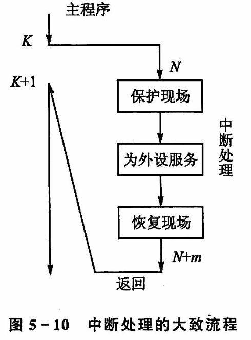
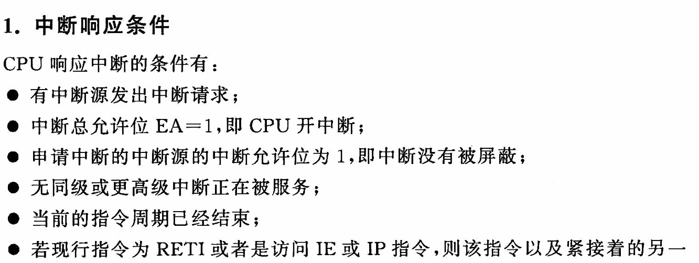
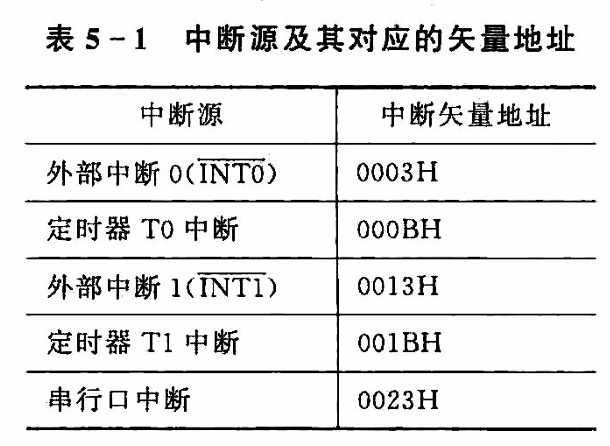
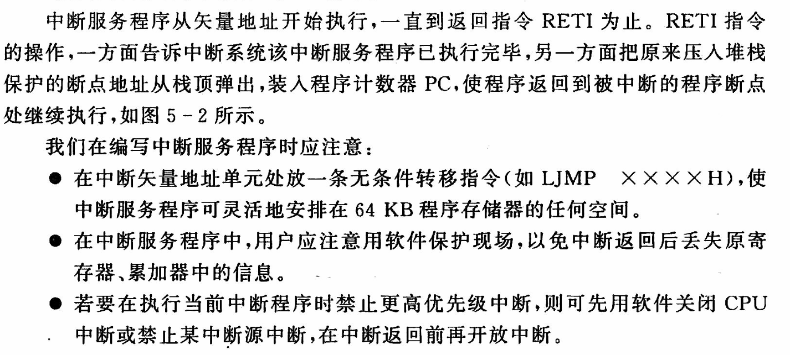
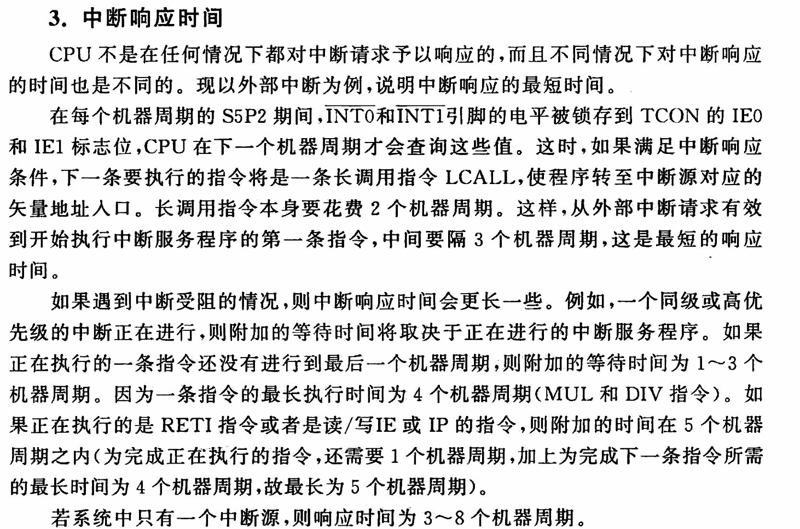
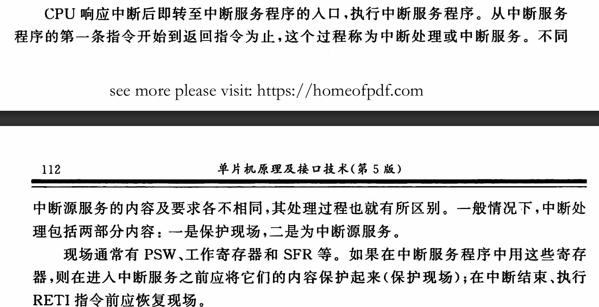
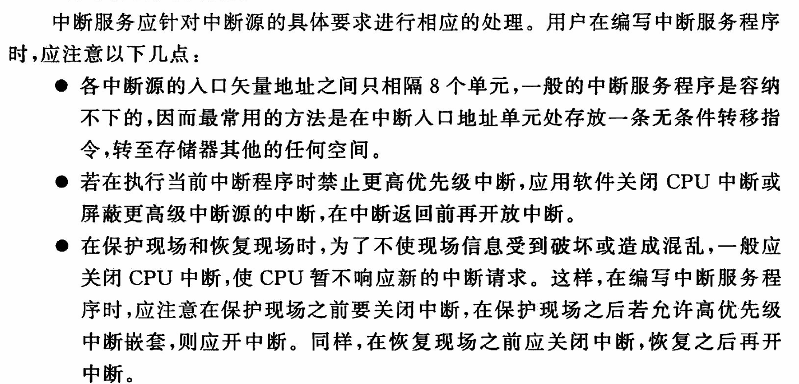
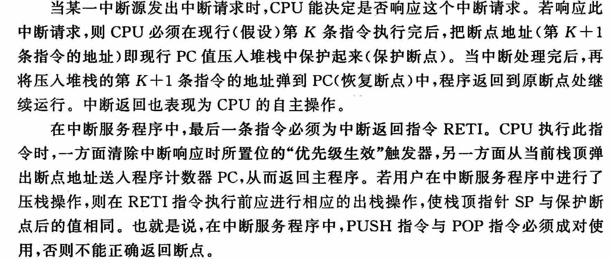
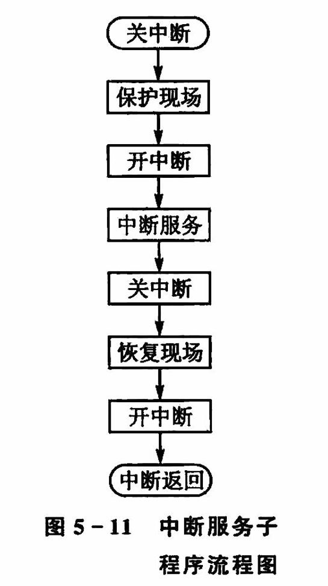

# 中断处理

- [中断处理](#中断处理)
  - [1 中断响应](#1-中断响应)
    - [1.1 中断响应的条件](#11-中断响应的条件)
    - [1.2 中断响应的过程](#12-中断响应的过程)
    - [1.3 中断响应时间](#13-中断响应时间)
  - [2 中断处理](#2-中断处理)
  - [3 中断返回](#3-中断返回)
  - [4 具体的中断服务程序](#4-具体的中断服务程序)

## 1 中断响应

### 1.1 中断响应的条件

### 1.2 中断响应的过程

1. 把当前 PC 值压入堆栈,保护断点
2. 将相应的中断服务程序的入口地址送入 PC
3. 对于某些中断源，CPU 会自动清除标志位
4. 执行总督那服务程序
5. 执行到返回指令 RETI,中断服务程序结束，将堆栈中的内容弹出到 PC,返回到原来的断点执行

### 1.3 中断响应时间

## 2 中断处理

## 3 中断返回

**保护和恢复由硬件自动完成，因为PC并不能改写**

**PUSH和POP指令必须成对出现**

## 4 具体的中断服务程序

**关中断可以防止中断，保护现场和恢复现场的过程不允许中断，以免现场遭到破坏**

中断返回后断点推回PC由硬件自动执行。

PC保护由硬件完成

