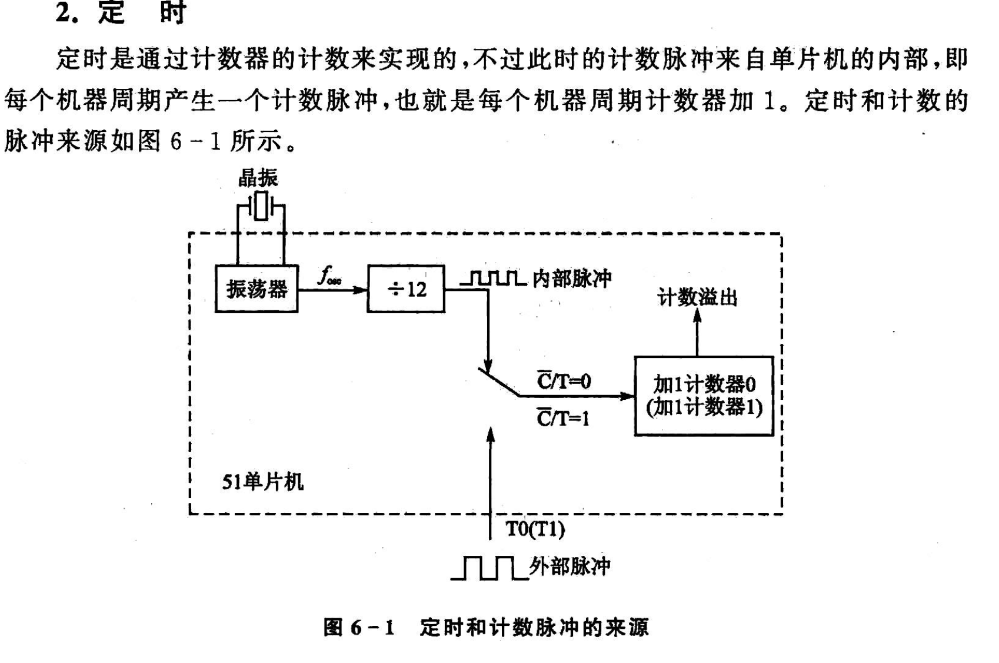
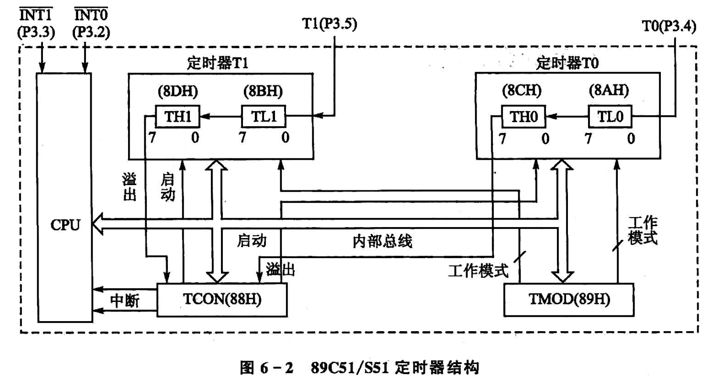
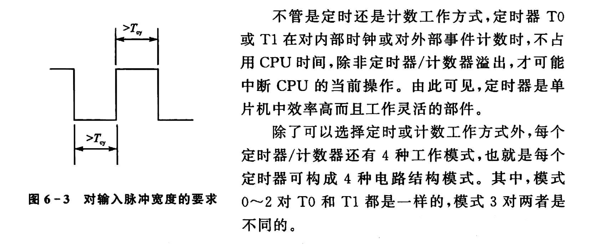

# 定时器模式

## 1 定时器简介

定时器/计数器就是为了对外部事件进行计数。

定时也是计数实现的，即统计特定频率信号的数量则可以实现定时。本质上世界上先要实现记时，就要实现稳定频率的时钟信号(水滴，机械摆，晶振，原子能级跃迁电磁波，铯原子)

## 2 定时器结构

**定时器不受CPU的影响,不占用CPU时间**

## 3 工作模式

定时器可以作为定时器也可以作为计数器

计满溢出为止，溢出触发定时器中断，产生中断请求。

**脉冲宽度要求大于机器周期!**
12M晶振，机器周期1us，只能记录0.5MHz的脉冲信号。
