# 串行口及其应用

## 1 结构

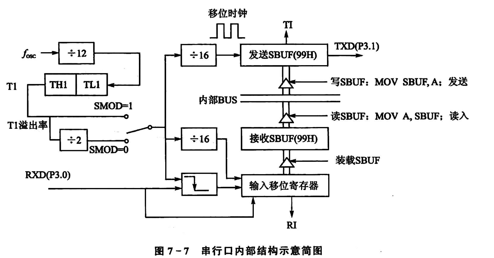
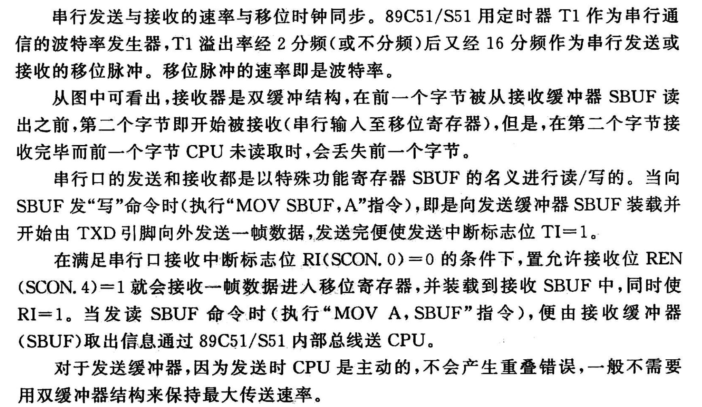

## 2 串行口寄存器

### 2.1 SCON(特殊功能寄存器)

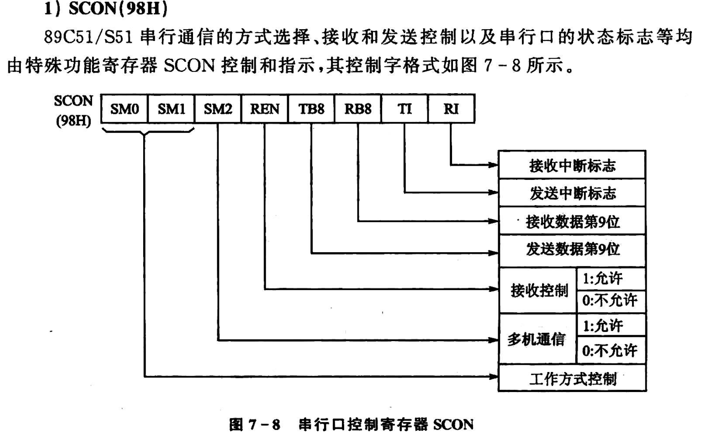
**多机通讯必须要第九位**

- **SCON 寄存器**
  - **SM0**: Serial Mode Control Bit 0（串行模式控制位 0）
  - **SM1**: Serial Mode Control Bit 1（串行模式控制位 1）
  - **SM2**: Multi-Machine Communication Control Bit（多机通信控制位）
  - **REN**: Receive Enable（接收使能）
  - **TB8**: Transmit Bit 8（发送第 9 位）
  - **RB8**: Receive Bit 8（接收第 9 位）
  - **TI**: Transmit Interrupt Flag（发送中断标志）
  - **RI**: Receive Interrupt Flag（接收中断标志）

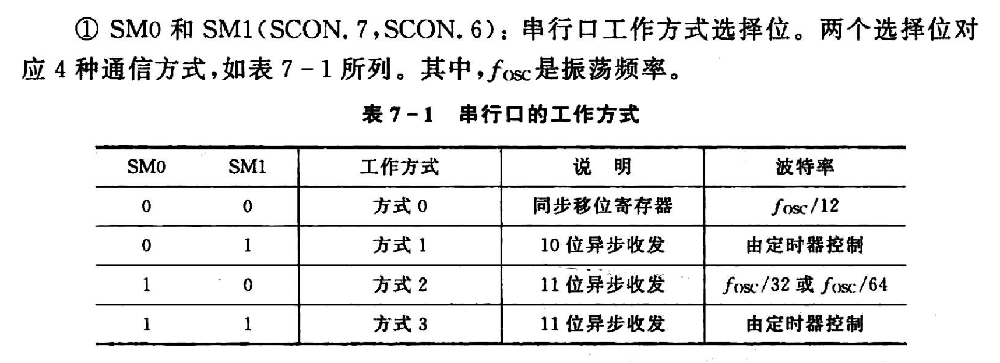
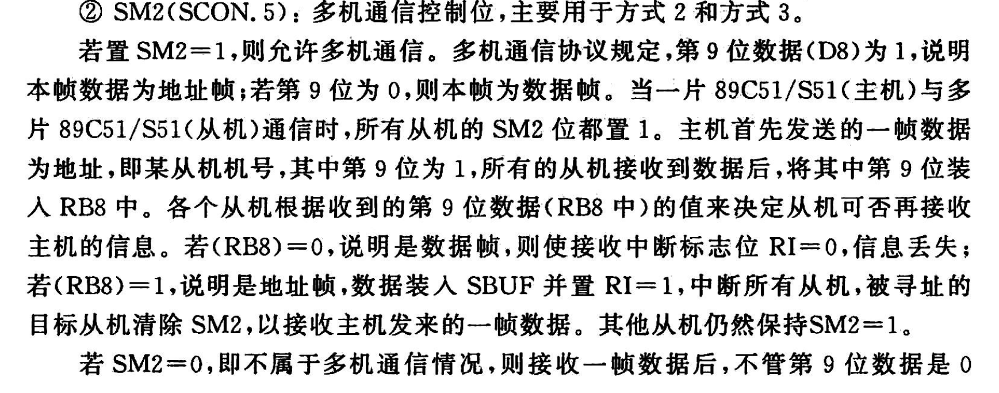
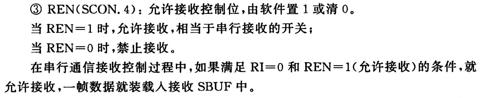
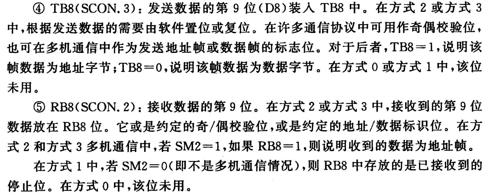
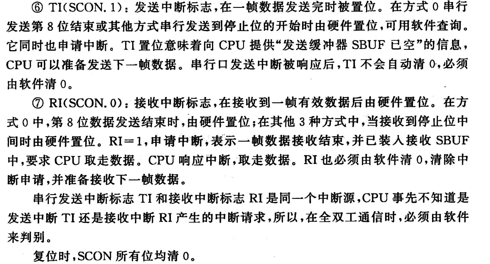

### 2.2 PCON

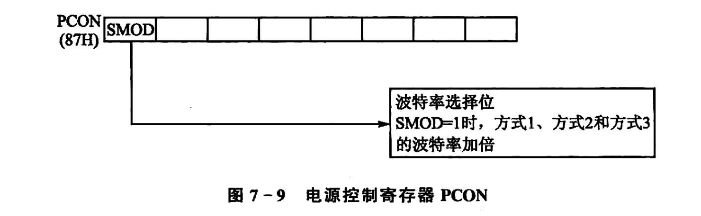

## 3 串行通信工作方式

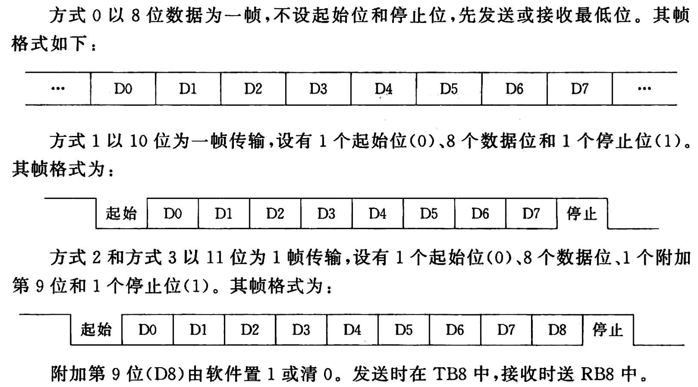

## 4 波特率设计

| 方式  | 公式                                                           |
| ----- | -------------------------------------------------------------- |
| 方式0 | \( \frac{f_{osc}}{12} \)                                       |
| 方式1 | \( \frac{2^{SMOD}\times \text{定时器} T1 \text{的频率}}{32} \) |
| 方式2 | \( f_{osc} \times \frac{2^{SMOD}}{64} \)                       |
| 方式3 | \( \frac{2^{SMOD}\times \text{定时器} T1 \text{的频率}}{32} \) |

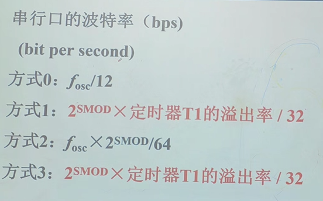

### 4.1 方式 0

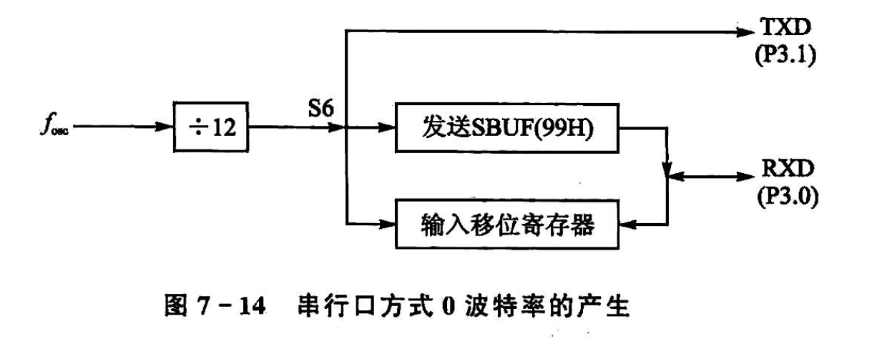
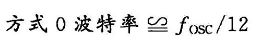
$$ \text{ 波特率} \quad \cong \frac{f_{\text{osc}}}{12}$$

$\cong$**表示一种数值相等，因为量纲不同**

### 4.3 方式 2

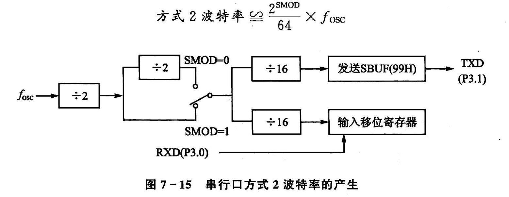
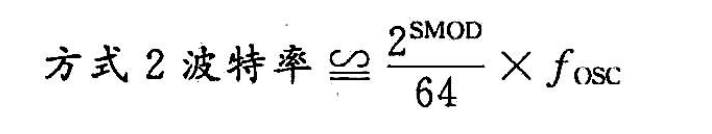

### 4.4 方式 1 和 3

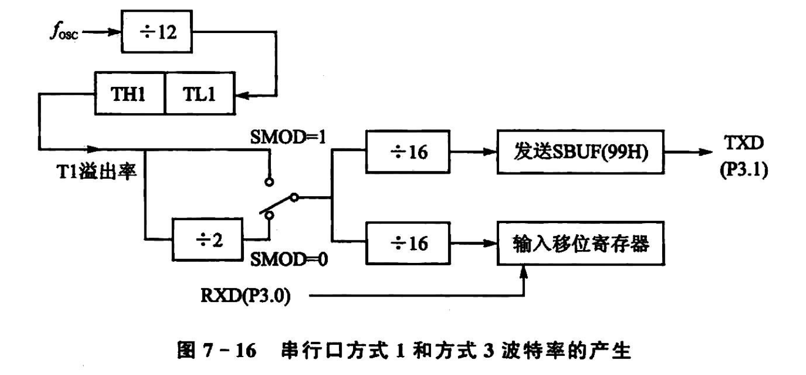
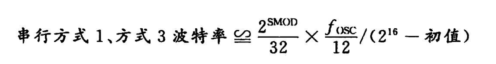

//CORE
**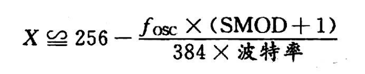**
